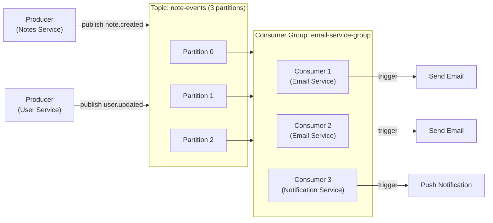

# Task: Kafka Setup and Fundamentals

**Related Issue:** #156, #157  
**Category:** Messaging  
**Prerequisites:** Docker, basic microservices understanding  
**Estimated Time:** 3 hours  
**Language:** Go or Python  
**Notes App Context:** Add Kafka as the messaging backbone for Notes App microservices

---

## Learning Objectives

- Understand Kafka's architecture and core concepts
- Set up Kafka locally with Docker Compose
- Create topics, produce messages, and consume messages
- Understand the role of Kafka in microservices

---

## Theory Section

### What is Kafka?

Apache Kafka is a **distributed event streaming platform**:
- **Producers** publish events to **topics**
- **Topics** are divided into **partitions** (append-only logs)
- **Consumers** subscribe to topics and process events
- **Consumer groups** allow parallel processing

### Core Concepts

| Concept | Description |
|---------|-------------|
| **Topic** | A category of messages (e.g., `note-events`) |
| **Partition** | A topic is split into N ordered partitions |
| **Offset** | Position of a message within a partition |
| **Producer** | Application that publishes messages |
| **Consumer** | Application that reads messages |
| **Consumer Group** | Group of consumers sharing processing load |
| **Broker** | A Kafka server that stores messages |
| **Zookeeper/KRaft** | Manages cluster metadata |

### Why Kafka for Microservices?

- **Decoupling**: Services don't need to know about each other
- **Reliability**: Messages are persisted — no lost events if a consumer is down
- **Scalability**: Partitions enable horizontal scaling
- **Replay**: Consumers can re-read old events by resetting their offset

---

## Step-by-Step Instructions

### Step 1: Start Kafka with Docker Compose

```yaml
version: '3'
services:
  zookeeper:
    image: confluentinc/cp-zookeeper:7.5.0
    environment:
      ZOOKEEPER_CLIENT_PORT: 2181
    
  kafka:
    image: confluentinc/cp-kafka:7.5.0
    depends_on: [zookeeper]
    ports:
      - "9092:9092"
    environment:
      KAFKA_BROKER_ID: 1
      KAFKA_ZOOKEEPER_CONNECT: zookeeper:2181
      KAFKA_ADVERTISED_LISTENERS: PLAINTEXT://localhost:9092
      KAFKA_OFFSETS_TOPIC_REPLICATION_FACTOR: 1
      
  kafka-ui:
    image: provectuslabs/kafka-ui:latest
    ports:
      - "8090:8080"
    environment:
      KAFKA_CLUSTERS_0_NAME: local
      KAFKA_CLUSTERS_0_BOOTSTRAPSERVERS: kafka:9092
```

### Step 2: Create Topics and Test

```bash
# Create a topic with 3 partitions
docker exec kafka kafka-topics --create \
  --topic note-events \
  --partitions 3 \
  --replication-factor 1 \
  --bootstrap-server localhost:9092

# List topics
docker exec kafka kafka-topics --list --bootstrap-server localhost:9092

# Produce test messages
docker exec -it kafka kafka-console-producer \
  --topic note-events --bootstrap-server localhost:9092

# Consume messages
docker exec -it kafka kafka-console-consumer \
  --topic note-events --from-beginning --bootstrap-server localhost:9092
```

### Step 3: Implement Producer in Notes Service

Write code that publishes a `note.created` event when a note is saved.

### Step 4: Implement Consumer in Email Service

Write code that reads `note.created` events and triggers emails.

---

## Verification

1. Kafka running locally with Kafka UI accessible
2. `note-events` topic created with 3 partitions
3. Producer publishes events
4. Consumer reads events

---

## Task Checklist

- [ ] Kafka running with Docker Compose
- [ ] Kafka UI accessible at port 8090
- [ ] Topics created and verified
- [ ] Producer implemented in Notes Service
- [ ] Consumer implemented in Email Service
- [ ] Events visible in Kafka UI

---

**Task Status:** [ ] Not Started | [ ] In Progress | [ ] Completed

---

## Diagram



---

## Automation Reference

> The steps above are **manual/raw** — they teach you the concept by doing it yourself.  
> The `automation/` directory contains the production-grade IaC equivalent:

| What | Where | Description |
|------|-------|-------------|
| Docker / Kafka Compose | [`automation/ansible/roles/docker/`](../../automation/ansible/roles/docker/) | Ansible role to deploy Kafka via Docker Compose on a VM |
| Kafka on Kubernetes | [`automation/ansible/roles/kubernetes/`](../../automation/ansible/roles/kubernetes/) | Ansible role to deploy Kafka with Strimzi or Helm on the K8s cluster |
