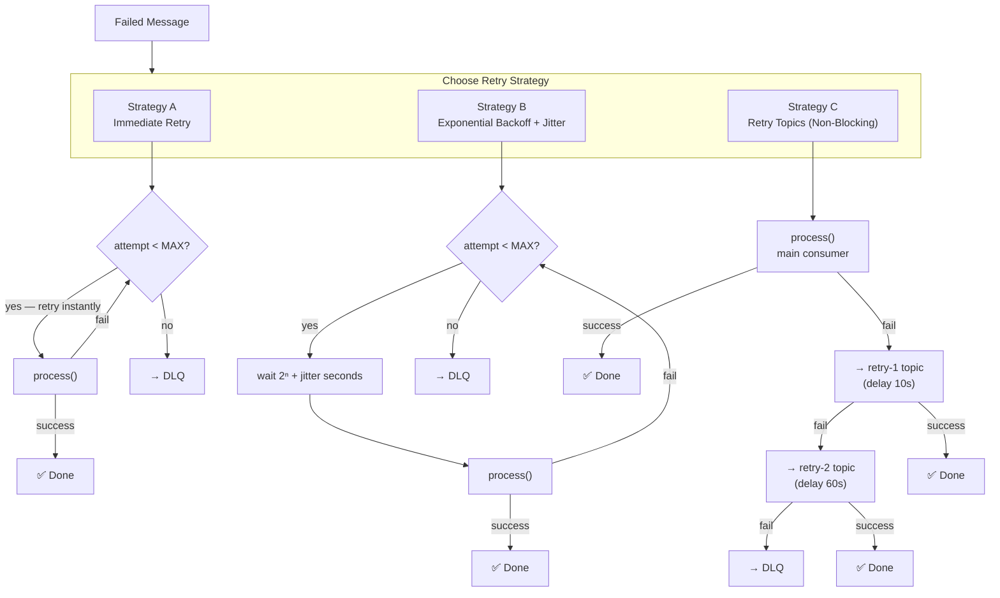

# Task: Retry Patterns in Kafka

**Related Issue:** #156  
**Category:** Messaging  
**Prerequisites:** task-002-dead-letter-queue  
**Estimated Time:** 2–3 hours  
**Language:** Go or Python  
**Notes App Context:** Resilient email delivery for the Notes App

---

## Learning Objectives

- Implement various retry patterns in Kafka consumers
- Understand the trade-offs between retry strategies
- Implement exponential backoff with jitter
- Know when to use synchronous vs asynchronous retries

---

## Retry Patterns Compared

| Pattern | Description | Pros | Cons |
|---------|-------------|------|------|
| Immediate retry | Retry right away | Simple | May overwhelm failing service |
| Fixed backoff | Wait N seconds between retries | Simple | No exponential pressure relief |
| Exponential backoff | Wait 1s, 2s, 4s, 8s... | Reduces thundering herd | Can cause long delays |
| Exponential backoff + jitter | Add randomness to backoff | Avoids thundering herd | More complex |
| Retry topics | Separate Kafka topic per retry level | Async, non-blocking | Infrastructure overhead |

---

## Step-by-Step Instructions

### Step 1: Implement Immediate Retry

```python
for attempt in range(MAX_RETRIES):
    try:
        process(msg)
        break
    except Exception:
        if attempt == MAX_RETRIES - 1:
            send_to_dlq(msg)
        time.sleep(0)  # no wait
```

### Step 2: Implement Exponential Backoff with Jitter

```python
import random

for attempt in range(MAX_RETRIES):
    try:
        process(msg)
        break
    except Exception:
        if attempt == MAX_RETRIES - 1:
            send_to_dlq(msg)
        # Exponential backoff with jitter
        delay = (2 ** attempt) + random.uniform(0, 1)
        time.sleep(delay)
```

### Step 3: Implement Retry Topics (Non-Blocking)

This pattern never blocks the main consumer — failed messages go to a retry topic and are processed separately:

1. Main consumer: processes `email-events`, on failure → send to `email-events-retry-1`
2. Retry-1 consumer: processes `email-events-retry-1` after 10s delay, on failure → `email-events-retry-2`
3. Retry-2 consumer: processes `email-events-retry-2` after 60s delay, on failure → `email-events-dlq`

### Step 4: Measure and Compare

For each retry pattern, measure:
- How long before a poison pill reaches the DLQ?
- Does the pattern block processing of other messages?
- What is the CPU/memory overhead?

---

## Task Checklist

- [ ] Implemented immediate retry
- [ ] Implemented exponential backoff with jitter
- [ ] Implemented retry topics pattern
- [ ] Measured and compared all three patterns
- [ ] Chose best pattern for the Notes App and documented why

---

**Task Status:** [ ] Not Started | [ ] In Progress | [ ] Completed

---

## Diagram



---

## Automation Reference

> The steps above are **manual/raw** — they teach you the concept by doing it yourself.  
> The `automation/` directory contains the production-grade IaC equivalent:

| What | Where | Description |
|------|-------|-------------|
| Kafka on Kubernetes | [`automation/ansible/roles/kubernetes/`](../../automation/ansible/roles/kubernetes/) | Deploy Kafka with retry-topic topology configured via Helm |
| Retry Count Alerting | [`automation/ansible/roles/monitoring/`](../../automation/ansible/roles/monitoring/) | Prometheus rules and Grafana panels alerting on high retry-topic message rates |
