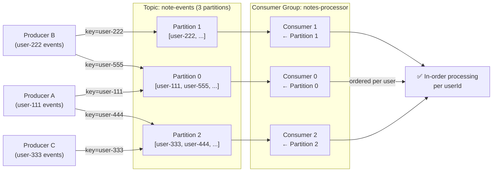

# Task: Kafka Partitions and Partition Keys

**Related Issue:** #157  
**Category:** Messaging  
**Prerequisites:** task-001-kafka-setup  
**Estimated Time:** 3–4 hours  
**Language:** Go or Python  
**Notes App Context:** Use user_id as partition key to ensure ordered processing per user

---

## Learning Objectives

- Understand how Kafka partitions work
- Understand partition keys and message ordering
- Set up multiple partitions and observe distribution
- Benchmark throughput with different partition counts

---

## Theory Section

### Partitions Enable Parallelism

```
Topic: note-events (3 partitions)

Partition 0: [msg1, msg4, msg7, ...]  ← Consumer A
Partition 1: [msg2, msg5, msg8, ...]  ← Consumer B  
Partition 2: [msg3, msg6, msg9, ...]  ← Consumer C
```

Three consumers can process in parallel — 3x throughput.

### Ordering Guarantee

**Within a partition**: messages are always ordered (by offset)  
**Across partitions**: no ordering guarantee

This means: if you need all events for user123 to be processed in order, all user123 events must go to the **same partition**.

### Partition Key

```python
# Without partition key: random partition (round-robin or random hash)
producer.produce('note-events', value=event_json)

# With partition key: deterministic partition based on key hash
producer.produce('note-events', key=user_id, value=event_json)
```

With `user_id` as key: all events for user123 → partition 2, all events for user456 → partition 0, etc.

---

## Step-by-Step Instructions

### Step 1: Create Topic with 3 Partitions

```bash
docker exec kafka kafka-topics --create \
  --topic note-events \
  --partitions 3 \
  --replication-factor 1 \
  --bootstrap-server localhost:9092
```

### Step 2: Observe Partition Distribution Without Key

```python
# Produce 30 messages without a partition key
for i in range(30):
    producer.produce('note-events', value=f'message-{i}')
producer.flush()

# Check distribution
# docker exec kafka kafka-run-class kafka.tools.GetOffsetShell \
#   --bootstrap-server localhost:9092 --topic note-events
```

Observe: messages are distributed roughly evenly (round-robin).

### Step 3: Observe Partition Distribution With Key

```python
# Produce messages with user_id as key
for i in range(30):
    user_id = f'user-{i % 5}'  # Only 5 unique users
    producer.produce('note-events', key=user_id, value=f'event for {user_id}')
producer.flush()
```

Observe: all events for each user always go to the same partition.

### Step 4: Verify Ordering Per User

```python
consumer = Consumer({...})
consumer.subscribe(['note-events'])

# Track events per user and verify ordering
user_events = {}
while True:
    msg = consumer.poll(1.0)
    if msg:
        user_id = msg.key().decode()
        seq = json.loads(msg.value())['sequence']
        
        if user_id in user_events:
            assert seq > user_events[user_id], f"Out of order for {user_id}!"
        user_events[user_id] = seq
```

### Step 5: Benchmark Throughput

1. Measure messages/second with 1 partition
2. Measure messages/second with 3 partitions (3 consumers)
3. Measure messages/second with 6 partitions (6 consumers)
4. Plot the results

### Step 6: Understand Partition Count Trade-offs

| Partition Count | Parallelism | Overhead | Ordering |
|----------------|-------------|----------|---------|
| 1 | None | Minimal | Global |
| 3 | 3x | Low | Per-key |
| 100 | 100x | High (memory, connections) | Per-key |

**Rule of thumb**: Start with 3–6 partitions; increase only when throughput demands it.

---

## Verification

1. Topic with 3 partitions created
2. Messages distributed evenly without partition key
3. Messages consistently routed to same partition with partition key
4. Ordering per user verified programmatically
5. Throughput benchmark completed

---

## Task Checklist

- [ ] Understood partition model conceptually
- [ ] Created topic with 3 partitions
- [ ] Observed partition distribution without key
- [ ] Observed consistent routing with user_id key
- [ ] Verified in-order processing per user
- [ ] Benchmarked throughput with different partition counts
- [ ] Understood partition count trade-offs

---

**Task Status:** [ ] Not Started | [ ] In Progress | [ ] Completed

---

## Diagram



---

## Automation Reference

> The steps above are **manual/raw** — they teach you the concept by doing it yourself.  
> The `automation/` directory contains the production-grade IaC equivalent:

| What | Where | Description |
|------|-------|-------------|
| Kafka on Kubernetes | [`automation/ansible/roles/kubernetes/`](../../automation/ansible/roles/kubernetes/) | Helm-based Kafka deployment with configurable partition counts per topic |
| Kafka via Docker | [`automation/ansible/roles/docker/`](../../automation/ansible/roles/docker/) | Docker Compose setup for local Kafka with multi-partition topic creation |
