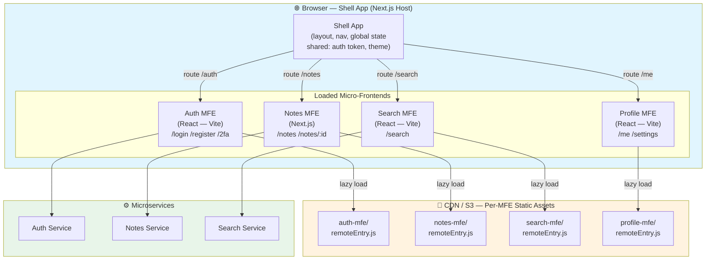

# Task: Introduction to Micro-Frontend Architecture

**Category:** Micro-Frontend  
**Prerequisites:** tasks/integration/frontend-001 through frontend-010 (monolithic Next.js app built)  
**Estimated Time:** 2–3 hours  
**Notes App Context:** Understand how to split the Notes App single-page frontend into independently deployable micro-frontends (Auth MFE, Notes MFE, Search MFE, Profile MFE) orchestrated by a Shell App.

---

## Learning Objectives

- Explain what micro-frontends are and why they exist
- Identify the decomposition boundaries in the Notes App frontend
- Compare the four main micro-frontend integration strategies
- Understand the Shell App (host) + Remote MFE pattern
- Know when to choose micro-frontends vs. a monolithic frontend

---

## Theory

### What is a Micro-Frontend?

Micro-frontends extend microservice thinking to the **browser layer**. Instead of one big frontend application owning the entire UI, independent teams own independent **vertical slices** of the UI — each slice is developed, tested, deployed, and scaled independently.

```
Monolithic Frontend:
┌──────────────────────────────────────────────────────────┐
│                   notes-app (Next.js)                    │
│  ┌──────────┐ ┌───────────┐ ┌──────────┐ ┌───────────┐  │
│  │  Auth UI │ │  Notes UI │ │Search UI │ │Profile UI │  │
│  └──────────┘ └───────────┘ └──────────┘ └───────────┘  │
│           One build. One deploy. One team.               │
└──────────────────────────────────────────────────────────┘

Micro-Frontend:
┌──────────────────── Shell App (Host) ───────────────────┐
│  Route: /auth   → [Auth MFE — Team Auth]                │
│  Route: /notes  → [Notes MFE — Team Notes]              │
│  Route: /search → [Search MFE — Team Search]            │
│  Route: /me     → [Profile MFE — Team Platform]         │
└─────────────────────────────────────────────────────────┘
  Each MFE: own repo, own CI/CD, own deploy cadence
```

### Notes App MFE Decomposition

| MFE | Routes | Team | Backend Calls |
|-----|--------|------|--------------|
| **Shell App** | `/` (layout, nav, routing) | Platform | Auth Service |
| **Auth MFE** | `/login`, `/register`, `/2fa` | Auth | Auth Service |
| **Notes MFE** | `/notes`, `/notes/:id` | Notes | Notes Service |
| **Search MFE** | `/search` | Search | Search Service |
| **Profile MFE** | `/me`, `/settings` | Platform | Auth + Notes |

### Four Integration Strategies

| Strategy | How | Pros | Cons | Best For |
|----------|-----|------|------|---------|
| **Build-time (npm packages)** | Shared as library; imported at build | Simple | Full rebuild on every MFE change | UI component libraries |
| **Run-time (Module Federation)** | Webpack 5 loads remote bundles at runtime | Independent deploys, lazy loading | Webpack coupling | ✅ Production MFEs |
| **iFrame** | `<iframe src="https://auth-mfe.com">` | Full isolation | Bad UX, no shared state | 3rd-party widgets |
| **Server-side composition** | Edge/server assembles HTML fragments | SEO-friendly | Complex infra | SSR-heavy apps |

---

## Diagram



---

## When to Use Micro-Frontends

✅ **Good fit:**
- Multiple teams working on the same frontend codebase
- Different parts of the UI have different release cadences
- Some features need to be reused across multiple products
- You already use microservices on the backend

❌ **Avoid when:**
- Small team (1–3 developers)
- Tight UI cohesion required (lots of cross-cutting state)
- Early-stage product (premature decomposition)
- SEO is critical and you're not doing server-side composition

---

## Step-by-Step: Map the Notes App

1. Draw the current monolithic Next.js app pages
2. Identify natural vertical slice boundaries (auth vs. notes vs. search vs. profile)
3. Identify shared state: auth token, user object, theme
4. Choose integration strategy: Module Federation (covered in task-002)
5. Plan the Shell App responsibilities: routing, shared context, global error boundary

---

## Verification Checklist

- [ ] Can explain what a micro-frontend is to a colleague
- [ ] Identified the 4 MFE boundaries in the Notes App
- [ ] Listed what lives in the Shell App vs. each MFE
- [ ] Chose Module Federation as the integration strategy and can justify why
- [ ] Aware of the shared state problem and how to solve it (shared library + context)

---

## Automation Reference

| What | Where | Description |
|------|-------|-------------|
| S3 buckets (per MFE) | [`automation/terraform/modules/s3/`](../../automation/terraform/modules/s3/) | Each MFE's static bundle deployed to its own S3 bucket prefix |
| CloudFront CDN | [`automation/terraform/modules/acm/`](../../automation/terraform/modules/acm/) | TLS cert for each MFE subdomain (`auth.notes-app.com`, `notes.notes-app.com`) |
| ECR (if SSR) | [`automation/terraform/modules/ecr/`](../../automation/terraform/modules/ecr/) | Container registry for MFEs that run as Node.js SSR servers |

---

**Task Status:** [ ] Not Started | [ ] In Progress | [ ] Completed  
**Date Started:** ___  
**Date Completed:** ___
