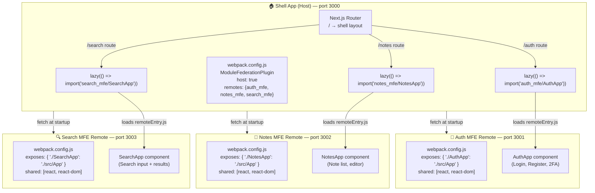

# Task: Webpack 5 Module Federation — Split Notes App into Micro-Frontends

**Category:** Micro-Frontend  
**Prerequisites:** task-001-introduction-to-micro-frontends.md  
**Estimated Time:** 4–6 hours  
**Languages:** TypeScript, React, Webpack 5, Next.js  
**Notes App Context:** Use Webpack 5 Module Federation to split the Notes App into a Shell (host) + 4 remote MFEs. Each MFE exposes its root component and is loaded lazily at runtime.

---

## Learning Objectives

- Configure Webpack 5 `ModuleFederationPlugin` for a host (Shell) and multiple remotes
- Expose and consume federated modules between MFEs
- Share singleton libraries (React, React-DOM, auth context) across MFEs without duplication
- Handle independent deployments — update one MFE without rebuilding the others
- Apply Module Federation in a Next.js 14 app using `@module-federation/nextjs-mf`

---

## Theory: How Module Federation Works

```
Build time:
  Each MFE builds independently → produces:
    - remoteEntry.js  ← manifest + chunk metadata
    - chunk files     ← actual code, loaded on demand

Runtime:
  Shell App loads:
    1. remoteEntry.js from each MFE URL  (async, at startup)
    2. When user navigates to /notes →
       Shell: import('notes_mfe/NotesApp')
       Webpack: checks remoteEntry, fetches only needed chunk
       Notes MFE renders inside Shell's React tree
```

### Shared Singletons

```javascript
// WRONG — two React instances = hooks crash
// Shell uses React 18.2 locally AND loads Notes MFE with its own React 18.2
// → "Invalid hook call" error

// RIGHT — declare React as shared singleton
shared: {
  react: { singleton: true, requiredVersion: '^18.2.0' },
  'react-dom': { singleton: true, requiredVersion: '^18.2.0' },
  'notes-app/shared': { singleton: true }  // shared auth context
}
```

---

## Diagram



---

## Step-by-Step: Configure Module Federation

### Step 1: Shell App (Host) — `webpack.config.js`

```javascript
// shell-app/webpack.config.js
const { ModuleFederationPlugin } = require('@module-federation/webpack');

module.exports = {
  plugins: [
    new ModuleFederationPlugin({
      name: 'shell',
      remotes: {
        auth_mfe:   'auth_mfe@http://localhost:3001/remoteEntry.js',
        notes_mfe:  'notes_mfe@http://localhost:3002/remoteEntry.js',
        search_mfe: 'search_mfe@http://localhost:3003/remoteEntry.js',
      },
      shared: {
        react:     { singleton: true, requiredVersion: '^18.2.0' },
        'react-dom': { singleton: true, requiredVersion: '^18.2.0' },
      },
    }),
  ],
};
```

### Step 2: Auth MFE (Remote) — `webpack.config.js`

```javascript
// auth-mfe/webpack.config.js
const { ModuleFederationPlugin } = require('@module-federation/webpack');

module.exports = {
  plugins: [
    new ModuleFederationPlugin({
      name: 'auth_mfe',
      filename: 'remoteEntry.js',
      exposes: {
        './AuthApp': './src/App',
        './LoginForm': './src/components/LoginForm',
      },
      shared: {
        react:     { singleton: true, requiredVersion: '^18.2.0' },
        'react-dom': { singleton: true, requiredVersion: '^18.2.0' },
      },
    }),
  ],
};
```

### Step 3: Consume in Shell App

```tsx
// shell-app/src/pages/auth.tsx
import React, { Suspense, lazy } from 'react';

// Lazy-load the remote Auth MFE
const AuthApp = lazy(() => import('auth_mfe/AuthApp'));

export default function AuthPage() {
  return (
    <Suspense fallback={<div>Loading auth...</div>}>
      <AuthApp />
    </Suspense>
  );
}
```

### Step 4: Share Auth State Across MFEs

```tsx
// shared-lib/src/auth-context.tsx
// Published as: notes-app/shared-auth
export const AuthContext = React.createContext<AuthContextType | null>(null);
export const useAuth = () => useContext(AuthContext);

// Shell App wraps everything:
// <AuthContext.Provider value={authState}>
//   {children}   ← all MFEs run inside here
// </AuthContext.Provider>

// Auth MFE (remote) can call useAuth() — gets the Shell's singleton context
```

### Step 5: Next.js 14 with Module Federation

```bash
npm install @module-federation/nextjs-mf
```

```javascript
// shell-app/next.config.js
const { NextFederationPlugin } = require('@module-federation/nextjs-mf');

module.exports = {
  webpack(config) {
    config.plugins.push(
      new NextFederationPlugin({
        name: 'shell',
        remotes: {
          notes_mfe: 'notes_mfe@http://localhost:3002/_next/static/chunks/remoteEntry.js',
        },
        shared: {},
      })
    );
    return config;
  },
};
```

---

## TypeScript: Declare Remote Module Types

```typescript
// shell-app/src/declarations.d.ts
declare module 'auth_mfe/AuthApp' {
  import { ComponentType } from 'react';
  const AuthApp: ComponentType<{}>;
  export default AuthApp;
}

declare module 'notes_mfe/NotesApp' {
  import { ComponentType } from 'react';
  const NotesApp: ComponentType<{}>;
  export default NotesApp;
}
```

---

## Local Development Setup

```bash
# Terminal 1: Start Auth MFE
cd auth-mfe && npm run dev    # port 3001

# Terminal 2: Start Notes MFE
cd notes-mfe && npm run dev   # port 3002

# Terminal 3: Start Search MFE
cd search-mfe && npm run dev  # port 3003

# Terminal 4: Start Shell (host)
cd shell-app && npm run dev   # port 3000 — loads remotes from localhost:300x
```

---

## Verification Checklist

- [ ] Auth MFE serves `remoteEntry.js` at `http://localhost:3001/remoteEntry.js`
- [ ] Shell App loads AuthApp from remote without bundling it locally
- [ ] Navigating to `/notes` lazily loads the Notes MFE bundle
- [ ] React is only instantiated once (singleton) — check DevTools → React tab shows one root
- [ ] Auth context from Shell is accessible inside Notes MFE via `useAuth()`
- [ ] Changing Auth MFE code does NOT require rebuilding Shell or Notes MFE

---

## Automation Reference

| What | Where | Description |
|------|-------|-------------|
| S3 static hosting | [`automation/terraform/modules/s3/`](../../automation/terraform/modules/s3/) | Each MFE's `dist/` (including `remoteEntry.js`) uploaded to its own S3 path |
| CloudFront CDN | [`automation/terraform/modules/acm/`](../../automation/terraform/modules/acm/) | CORS + cache-control headers for `remoteEntry.js` (no cache) vs. chunks (long cache) |
| CI/CD per MFE | [`tasks/ci-cd/task-001.md`](../ci-cd/task-001.md) | Each MFE has its own GitHub Actions workflow; only builds and deploys its own S3 prefix |

---

**Task Status:** [ ] Not Started | [ ] In Progress | [ ] Completed  
**Date Started:** ___  
**Date Completed:** ___
