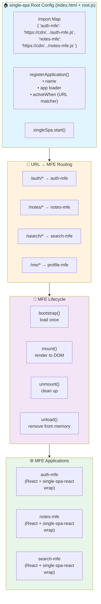

# Task: Single-SPA — Alternative Micro-Frontend Orchestration

**Category:** Micro-Frontend  
**Prerequisites:** task-001-introduction-to-micro-frontends.md  
**Estimated Time:** 3–4 hours  
**Languages:** TypeScript, React, single-spa  
**Notes App Context:** Use single-spa as an alternative to Module Federation. Single-spa provides a framework-agnostic orchestrator that can run React, Vue, and Angular MFEs side-by-side. Compare with Module Federation to decide which fits your team's needs.

---

## Learning Objectives

- Set up a single-spa root config (orchestrator)
- Register and activate micro-frontend applications by URL route
- Use `create-single-spa` CLI to scaffold MFEs
- Share utilities via import maps (SystemJS) or via a shared utility package
- Compare single-spa vs. Module Federation trade-offs

---

## Theory: How single-spa Works

```
single-spa Lifecycle:
                  URL: /notes
                       ↓
  Root Config: "which MFE owns /notes?"
                       ↓
  Registered MFE: notes-mfe matches
                       ↓
  Lifecycle:
    bootstrap()  → load MFE bundle (if not loaded yet)
    mount()      → render MFE into <div id="notes-mfe-container">
    unmount()    → clean up when user navigates away
```

### Comparison: Module Federation vs single-spa

| Feature | Module Federation | single-spa |
|---------|------------------|-----------|
| Framework | Webpack 5 | Framework-agnostic |
| Mixed frameworks (React + Vue) | ❌ Hard | ✅ Native support |
| Component sharing | ✅ Excellent | ⚠️ Via import maps |
| Setup complexity | Medium | Higher |
| Routing control | Host app controls | single-spa controls |
| SSR support | ✅ (nextjs-mf) | ⚠️ Limited |
| Recommended for Notes App | ✅ (all React) | ✅ If mixing frameworks later |

---

## Diagram



---

## Step-by-Step

### Step 1: Scaffold with create-single-spa CLI

```bash
# Install CLI
npm install -g create-single-spa

# Create root config (orchestrator)
create-single-spa --moduleType root-config --framework none
# → notes-app-root/

# Create Auth MFE
create-single-spa --moduleType app-parcel --framework react
# → auth-mfe/

# Create Notes MFE
create-single-spa --moduleType app-parcel --framework react
# → notes-mfe/

# Create utility module (shared state)
create-single-spa --moduleType util-module
# → notes-app-shared/
```

### Step 2: Root Config — Register All MFEs

```javascript
// root-config/src/notes-app-root-config.js
import { registerApplication, start } from 'single-spa';

registerApplication({
  name: '@notes-app/auth-mfe',
  app: () => System.import('@notes-app/auth-mfe'),
  activeWhen: ['/auth'],
});

registerApplication({
  name: '@notes-app/notes-mfe',
  app: () => System.import('@notes-app/notes-mfe'),
  activeWhen: ['/notes'],
});

registerApplication({
  name: '@notes-app/search-mfe',
  app: () => System.import('@notes-app/search-mfe'),
  activeWhen: ['/search'],
});

start({
  urlRerouteOnly: true, // only re-route on pushState/replaceState
});
```

### Step 3: Wrap a React App for single-spa

```typescript
// notes-mfe/src/index.ts
import React from 'react';
import ReactDOM from 'react-dom';
import singleSpaReact from 'single-spa-react';
import App from './App';

const lifecycles = singleSpaReact({
  React,
  ReactDOM,
  rootComponent: App,
  errorBoundary(err, info, props) {
    return <div>Notes MFE failed to load: {err.message}</div>;
  },
});

export const { bootstrap, mount, unmount } = lifecycles;
```

### Step 4: Import Map (SystemJS)

```html
<!-- root-config/src/index.ejs -->
<script type="systemjs-importmap">
  {
    "imports": {
      "@notes-app/root-config": "http://localhost:9000/notes-app-root-config.js",
      "@notes-app/auth-mfe":    "http://localhost:9001/notes-app-auth-mfe.js",
      "@notes-app/notes-mfe":   "http://localhost:9002/notes-app-notes-mfe.js",
      "@notes-app/search-mfe":  "http://localhost:9003/notes-app-search-mfe.js",
      "react":                  "https://cdn.jsdelivr.net/npm/react@18.2.0/umd/react.production.min.js",
      "react-dom":              "https://cdn.jsdelivr.net/npm/react-dom@18.2.0/umd/react-dom.production.min.js"
    }
  }
</script>
```

### Step 5: Shared State via Utility Module

```typescript
// notes-app-shared/src/auth-store.ts
import { BehaviorSubject } from 'rxjs';

export interface AuthState {
  token: string | null;
  user: { id: string; email: string } | null;
}

const authSubject = new BehaviorSubject<AuthState>({ token: null, user: null });

export const authStore = {
  getState: () => authSubject.getValue(),
  setState: (state: Partial<AuthState>) =>
    authSubject.next({ ...authSubject.getValue(), ...state }),
  subscribe: (fn: (s: AuthState) => void) => authSubject.subscribe(fn),
};
```

```typescript
// auth-mfe — after login:
import { authStore } from '@notes-app/shared';
authStore.setState({ token: jwt, user: { id, email } });

// notes-mfe — read auth state:
import { authStore } from '@notes-app/shared';
const { token } = authStore.getState();
```

---

## Verification Checklist

- [ ] Root config starts at `localhost:9000` and loads with no errors
- [ ] Navigating to `/auth` mounts the Auth MFE and unmounts when leaving
- [ ] Navigating to `/notes` mounts Notes MFE; Auth MFE is unmounted
- [ ] Login in Auth MFE updates shared auth store, Notes MFE reads it correctly
- [ ] Browser Network tab: MFE JS bundle is only loaded on first visit to that route
- [ ] Mixed framework test: replace Search MFE with a Vue component (single-spa supports it)

---

## Automation Reference

| What | Where | Description |
|------|-------|-------------|
| S3 static hosting | [`automation/terraform/modules/s3/`](../../automation/terraform/modules/s3/) | Each MFE bundle deployed to `s3://notes-app-mfe/{mfe-name}/` prefix |
| Import map deployment | [`tasks/ci-cd/task-001.md`](../ci-cd/task-001.md) | CI pipeline updates import map JSON in S3 after MFE deploy |
| CloudFront | [`automation/terraform/modules/acm/`](../../automation/terraform/modules/acm/) | Single CloudFront distribution serves all MFE paths via S3 origins |

---

**Task Status:** [ ] Not Started | [ ] In Progress | [ ] Completed  
**Date Started:** ___  
**Date Completed:** ___
