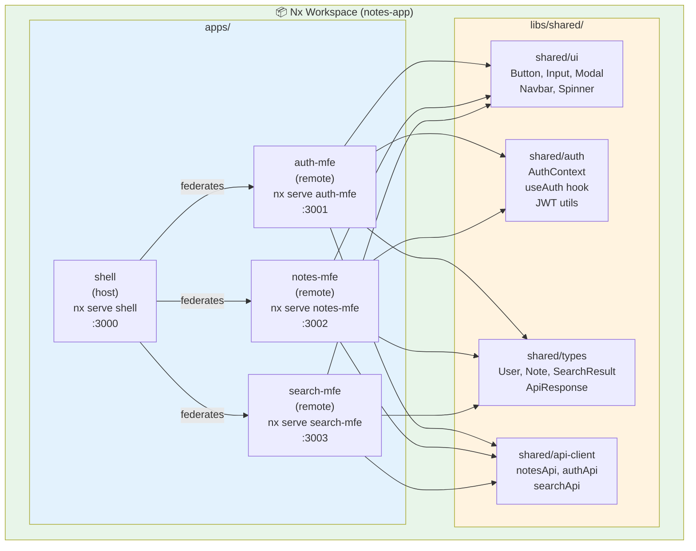

# Task: Nx Monorepo for Micro-Frontends

**Category:** Micro-Frontend  
**Prerequisites:** task-002-module-federation-webpack5.md, tasks/microservices/task-009-nx-monorepo-for-microservices.md  
**Estimated Time:** 3–4 hours  
**Languages:** TypeScript, React, Nx, Webpack 5  
**Notes App Context:** Extend the existing Nx workspace (currently used for backend microservices) to also manage ALL micro-frontend applications. All frontend MFEs share type definitions, UI components, and auth utilities via Nx shared libraries.

---

## Learning Objectives

- Extend the existing Nx workspace to include frontend applications
- Create Nx-managed React micro-frontend apps with Module Federation built in
- Use `@nx/react:module-federation-host` and `@nx/react:module-federation-remote` generators
- Share Nx libraries (UI components, auth types, API clients) across all MFEs
- Run all MFEs in parallel with a single `nx serve shell` command

---

## Theory: Nx + Module Federation

Nx has first-class support for Module Federation. Its generators automatically wire up `ModuleFederationPlugin`, `webpack.config.js`, and TypeScript declarations. The Nx dependency graph ensures you never accidentally break a shared library.

```
Nx Workspace (extended):
├── apps/
│   ├── shell/           ← Host (Module Federation host app)
│   ├── auth-mfe/        ← Remote MFE
│   ├── notes-mfe/       ← Remote MFE
│   ├── search-mfe/      ← Remote MFE
│   ├── profile-mfe/     ← Remote MFE
│   │
│   ├── auth-service/    ← (existing) Go/Node.js backend
│   └── notes-service/   ← (existing) Go/Node.js backend
│
└── libs/
    ├── shared/
    │   ├── ui/          ← Shared React components (Button, Input, Modal)
    │   ├── auth/        ← useAuth hook + AuthContext (singleton)
    │   ├── types/       ← Shared TypeScript interfaces
    │   └── api-client/  ← Typed API clients (notes, auth, search)
    └── feature/
        ├── notes/       ← Note editor logic (shared between notes-mfe + search-mfe)
        └── auth/        ← Login/Register forms (used only in auth-mfe)
```

---

## Diagram



---

## Step-by-Step

### Step 1: Generate the Shell (Host) App

```bash
# Inside the existing Nx workspace
nx generate @nx/react:host shell \
  --remotes=auth-mfe,notes-mfe,search-mfe,profile-mfe \
  --directory=apps/shell \
  --bundler=webpack \
  --style=tailwind \
  --unitTestRunner=jest
```

This automatically:
- Creates `apps/shell/` with `webpack.config.js` using `ModuleFederationPlugin`
- Adds `remotes` config pointing to each MFE
- Generates TypeScript declarations for remote imports
- Wires routing stubs for each remote

### Step 2: Generate Remote MFEs

```bash
# Auth MFE
nx generate @nx/react:remote auth-mfe \
  --host=shell \
  --port=3001 \
  --directory=apps/auth-mfe \
  --bundler=webpack \
  --style=tailwind

# Notes MFE
nx generate @nx/react:remote notes-mfe \
  --host=shell \
  --port=3002 \
  --directory=apps/notes-mfe \
  --bundler=webpack \
  --style=tailwind

# Search MFE
nx generate @nx/react:remote search-mfe \
  --host=shell \
  --port=3003 \
  --directory=apps/search-mfe \
  --bundler=webpack \
  --style=tailwind
```

### Step 3: Create Shared Libraries

```bash
# Shared UI component library
nx generate @nx/react:library shared-ui \
  --directory=libs/shared/ui \
  --bundler=vite \
  --unitTestRunner=jest

# Shared auth context + hooks
nx generate @nx/react:library shared-auth \
  --directory=libs/shared/auth \
  --bundler=vite

# Shared TypeScript types
nx generate @nx/js:library shared-types \
  --directory=libs/shared/types \
  --bundler=tsc

# Shared API clients
nx generate @nx/js:library shared-api-client \
  --directory=libs/shared/api-client \
  --bundler=tsc
```

### Step 4: Use Shared Library in MFE

```typescript
// apps/notes-mfe/src/app/app.tsx
import { Button, Modal } from '@notes-app/shared-ui';
import { useAuth } from '@notes-app/shared-auth';
import type { Note } from '@notes-app/shared-types';
import { notesApi } from '@notes-app/shared-api-client';

export function App() {
  const { user } = useAuth();  // uses Shell's singleton AuthContext
  // ...
}
```

### Step 5: Run Everything Together

```bash
# Start Shell + all remotes in parallel (Nx handles process management)
nx serve shell

# Nx automatically starts:
#   shell       → http://localhost:3000
#   auth-mfe    → http://localhost:3001
#   notes-mfe   → http://localhost:3002
#   search-mfe  → http://localhost:3003
#   profile-mfe → http://localhost:3004
```

### Step 6: Dependency Graph

```bash
# Visualize all app + lib dependencies
nx graph

# Check what's affected by a change to shared-auth
nx affected:graph --base=main

# Run tests only for affected projects
nx affected:test --base=main
```

### Step 7: Build for Production

```bash
# Build each MFE independently
nx build auth-mfe --prod
nx build notes-mfe --prod
# ... etc.

# Or build all in parallel using Nx Cloud / local caching
nx run-many --target=build --all --parallel=4 --prod
```

---

## Verification Checklist

- [ ] `nx serve shell` starts Shell + all 4 MFE remotes in one command
- [ ] `nx graph` shows correct dependency graph: MFEs → shared libs → shell
- [ ] Changing `shared-auth` → `nx affected:test` correctly identifies auth-mfe, notes-mfe, search-mfe as affected
- [ ] `nx build auth-mfe --prod` produces `remoteEntry.js` in `dist/apps/auth-mfe/`
- [ ] Shared UI components render identically in Shell and each MFE
- [ ] Nx caching works — second `nx build` is instant (cache hit)

---

## Automation Reference

| What | Where | Description |
|------|-------|-------------|
| Nx monorepo (backend) | [`implementation/microservices/task-009-nx-monorepo/`](../../implementation/microservices/task-009-nx-monorepo/) | Extend this workspace to add frontend apps |
| CI/CD per MFE | [`tasks/ci-cd/task-014-pipeline-gating-ci-before-cd.md`](../ci-cd/task-014-pipeline-gating-ci-before-cd.md) | `nx affected:build` in CI so only changed MFEs rebuild |
| ECR (if SSR MFEs) | [`automation/terraform/modules/ecr/`](../../automation/terraform/modules/ecr/) | Container registry for Next.js SSR micro-frontend containers |
| S3 (CSR MFEs) | [`automation/terraform/modules/s3/`](../../automation/terraform/modules/s3/) | Static hosting for client-side-rendered MFE bundles |

---

**Task Status:** [ ] Not Started | [ ] In Progress | [ ] Completed  
**Date Started:** ___  
**Date Completed:** ___
