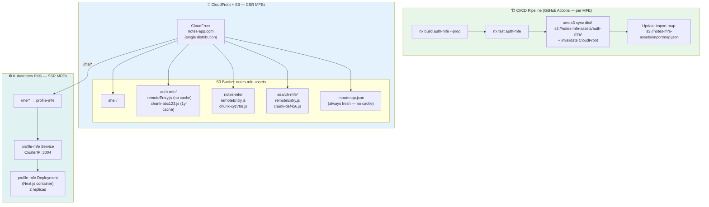

# Task: Deploy Micro-Frontends to Kubernetes + CDN

**Category:** Micro-Frontend  
**Prerequisites:** task-002 (Module Federation), task-004 (Nx build), tasks/kubernetes/ (K8s basics), tasks/ci-cd/  
**Estimated Time:** 4–5 hours  
**Languages:** TypeScript, Docker, Nginx, Terraform, GitHub Actions  
**Notes App Context:** Each MFE is built independently by CI, uploaded to its own S3 prefix, and served via CloudFront CDN. SSR MFEs (Next.js) also run as Kubernetes Deployments. Import maps are updated atomically to perform zero-downtime "deployments" of static MFEs.

---

## Learning Objectives

- Understand two MFE deployment patterns: CSR (static S3+CDN) vs. SSR (container on K8s)
- Build per-MFE Docker images and push to ECR
- Deploy SSR MFEs as Kubernetes Deployments behind an Ingress
- Serve CSR MFEs from S3 + CloudFront with correct cache headers
- Perform zero-downtime MFE releases by atomically updating the import map

---

## Theory: CSR vs. SSR MFE Deployment

```
CSR MFE (client-side rendered):
  Build → remoteEntry.js + chunks → upload to S3
  CDN serves directly — no server required
  Deploy: aws s3 sync dist/ s3://mfe-bucket/notes-mfe/
  ✅ Zero server ops, instant global scale

SSR MFE (server-side rendered — Next.js):
  Build → Docker image → push to ECR
  Kubernetes Deployment + Service + Ingress
  ✅ Better SEO, faster initial load
  ⚠️ Needs container + K8s management
```

---

## Diagram



---

## Step-by-Step

### Step 1: CI Pipeline — Build and Deploy CSR MFE (GitHub Actions)

```yaml
# .github/workflows/auth-mfe.yml
name: Auth MFE CI/CD

on:
  push:
    paths:
      - 'apps/auth-mfe/**'
      - 'libs/shared/**'

jobs:
  build-and-deploy:
    runs-on: ubuntu-latest
    steps:
      - uses: actions/checkout@v4

      - name: Setup Node.js
        uses: actions/setup-node@v4
        with:
          node-version: '20'
          cache: 'npm'

      - name: Install dependencies
        run: npm ci

      - name: Test
        run: nx test auth-mfe --ci

      - name: Build
        run: nx build auth-mfe --prod

      - name: Configure AWS credentials
        uses: aws-actions/configure-aws-credentials@v4
        with:
          role-to-assume: ${{ secrets.AWS_ROLE_ARN }}
          aws-region: us-east-1

      - name: Deploy to S3
        run: |
          # Upload chunks with long-lived cache (content-hashed filenames)
          aws s3 sync dist/apps/auth-mfe/ s3://${{ secrets.MFE_BUCKET }}/auth-mfe/ \
            --exclude "remoteEntry.js" \
            --cache-control "public, max-age=31536000, immutable"

          # Upload remoteEntry.js with NO cache (always latest)
          aws s3 cp dist/apps/auth-mfe/remoteEntry.js \
            s3://${{ secrets.MFE_BUCKET }}/auth-mfe/remoteEntry.js \
            --cache-control "no-cache, no-store, must-revalidate"

      - name: Invalidate CloudFront (remoteEntry.js only)
        run: |
          aws cloudfront create-invalidation \
            --distribution-id ${{ secrets.CF_DISTRIBUTION_ID }} \
            --paths "/auth-mfe/remoteEntry.js"
```

### Step 2: Atomic Import Map Update (single-spa pattern)

```bash
# scripts/update-importmap.sh
#!/bin/bash
MFE_NAME=$1      # e.g. "auth-mfe"
NEW_VERSION=$2   # e.g. "sha-abc123"
BUCKET=$3        # e.g. "notes-mfe-assets"

# Fetch current import map
aws s3 cp s3://$BUCKET/importmap.json /tmp/importmap.json

# Update the entry for this MFE
jq --arg mfe "$MFE_NAME" \
   --arg url "https://cdn.notes-app.com/$MFE_NAME/remoteEntry.js?v=$NEW_VERSION" \
   '.imports[$mfe] = $url' \
   /tmp/importmap.json > /tmp/importmap-new.json

# Upload atomically
aws s3 cp /tmp/importmap-new.json \
  s3://$BUCKET/importmap.json \
  --cache-control "no-cache, no-store"

# Invalidate import map on CDN
aws cloudfront create-invalidation \
  --distribution-id $CF_DISTRIBUTION_ID \
  --paths "/importmap.json"
```

### Step 3: Docker Image for SSR MFE (Next.js)

```dockerfile
# apps/profile-mfe/Dockerfile
FROM node:20-alpine AS deps
WORKDIR /app
COPY package*.json ./
RUN npm ci --only=production

FROM node:20-alpine AS builder
WORKDIR /app
COPY . .
RUN npx nx build profile-mfe --prod

FROM node:20-alpine AS runner
WORKDIR /app
ENV NODE_ENV=production
COPY --from=deps /app/node_modules ./node_modules
COPY --from=builder /app/dist/apps/profile-mfe .next/standalone ./
EXPOSE 3004
CMD ["node", "server.js"]
```

```bash
# Build and push to ECR
docker build -t profile-mfe -f apps/profile-mfe/Dockerfile .
docker tag profile-mfe:latest $ECR_URI/profile-mfe:$GIT_SHA
docker push $ECR_URI/profile-mfe:$GIT_SHA
```

### Step 4: Kubernetes Manifests for SSR MFE

```yaml
# k8s/profile-mfe/deployment.yaml
apiVersion: apps/v1
kind: Deployment
metadata:
  name: profile-mfe
  namespace: notes-app
spec:
  replicas: 2
  selector:
    matchLabels:
      app: profile-mfe
  template:
    metadata:
      labels:
        app: profile-mfe
    spec:
      containers:
        - name: profile-mfe
          image: $ECR_URI/profile-mfe:$GIT_SHA
          ports:
            - containerPort: 3004
          env:
            - name: AUTH_SERVICE_URL
              value: http://auth-service.notes-app.svc.cluster.local:3000
            - name: NOTES_SERVICE_URL
              value: http://notes-service.notes-app.svc.cluster.local:3000
          resources:
            requests:
              cpu: 100m
              memory: 128Mi
            limits:
              cpu: 500m
              memory: 512Mi
          readinessProbe:
            httpGet:
              path: /api/health
              port: 3004
            initialDelaySeconds: 10
---
apiVersion: v1
kind: Service
metadata:
  name: profile-mfe
  namespace: notes-app
spec:
  selector:
    app: profile-mfe
  ports:
    - port: 3004
      targetPort: 3004
```

### Step 5: NGINX Ingress — Unified Routing

```yaml
# k8s/ingress.yaml
apiVersion: networking.k8s.io/v1
kind: Ingress
metadata:
  name: notes-app-ingress
  namespace: notes-app
  annotations:
    nginx.ingress.kubernetes.io/rewrite-target: /
spec:
  ingressClassName: nginx
  tls:
    - hosts:
        - notes-app.com
      secretName: notes-app-tls
  rules:
    - host: notes-app.com
      http:
        paths:
          # SSR routes → K8s services
          - path: /me
            pathType: Prefix
            backend:
              service:
                name: profile-mfe
                port:
                  number: 3004
          # All other routes → CloudFront (CSR MFEs + static assets)
          # Handled at DNS level: notes-app.com → CloudFront
```

---

## Cache Strategy Summary

| Asset | Cache-Control | Why |
|-------|--------------|-----|
| `remoteEntry.js` | `no-cache` | Must always be fresh — it's the module manifest |
| `chunk-abc123.js` | `max-age=31536000, immutable` | Content-hashed — safe to cache forever |
| `importmap.json` | `no-cache` | Always fresh — controls which MFE version loads |
| `index.html` | `no-cache` | Always fresh — references importmap |

---

## Verification Checklist

- [ ] `auth-mfe` CI pipeline triggers only on changes to `apps/auth-mfe/**` or `libs/shared/**`
- [ ] `remoteEntry.js` uploaded with `no-cache` header
- [ ] Content-hashed JS chunks uploaded with `max-age=31536000` header
- [ ] CloudFront invalidation triggered for `remoteEntry.js` on each deploy
- [ ] `profile-mfe` Kubernetes deployment rolling update works without downtime
- [ ] Import map updated atomically — no window where two MFE versions conflict

---

## Automation Reference

| What | Where | Description |
|------|-------|-------------|
| S3 bucket + CORS | [`automation/terraform/modules/s3/`](../../automation/terraform/modules/s3/) | CORS policy allows CloudFront to fetch MFE bundles cross-origin |
| CloudFront distribution | [`automation/terraform/modules/acm/`](../../automation/terraform/modules/acm/) | TLS cert + CDN distribution for all MFE subpaths |
| ECR (SSR images) | [`automation/terraform/modules/ecr/`](../../automation/terraform/modules/ecr/) | Container registry for profile-mfe (Next.js SSR) |
| EKS deployment | [`automation/terraform/modules/eks/`](../../automation/terraform/modules/eks/) | K8s cluster hosting SSR MFE pods |
| IAM (CI role) | [`automation/terraform/modules/iam/`](../../automation/terraform/modules/iam/) | GitHub Actions OIDC role with S3 write + CloudFront invalidation permissions |

---

**Task Status:** [ ] Not Started | [ ] In Progress | [ ] Completed  
**Date Started:** ___  
**Date Completed:** ___
