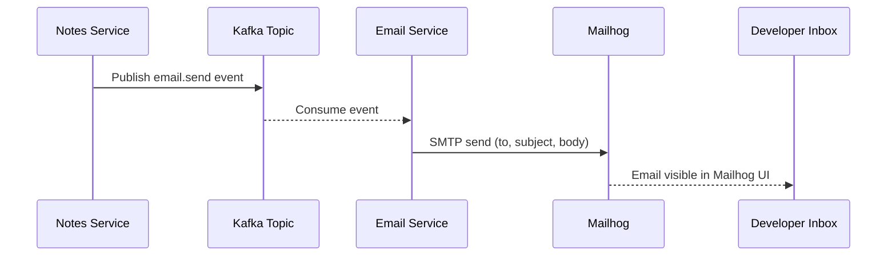

# Task: Email Service in Microservices

**Related Issue:** #152  
**Category:** Microservices  
**Prerequisites:** task-001 (Microservices architecture), task-001 (Kafka setup)  
**Estimated Time:** 4–5 hours  
**Language:** Go (primary) or Python  
**Notes App Context:** Build a dedicated Email Service that the Notes App triggers via Kafka

---

## Learning Objectives

- Build a standalone Email Service as a microservice
- Set up Mailhog for local email testing
- Consume email events from Kafka
- Handle distributed failures (service down, malformed events)
- Apply idempotency to prevent duplicate emails

---

## Theory Section

### Why a Dedicated Email Service?

In a monolith, email sending is a library call in the same process.  
In microservices, the Email Service is a **standalone service** because:
- Email sending is **slow** (SMTP is slow) — decoupling prevents blocking
- Email can **fail** — other services shouldn't wait or fail with it
- Email logic can be **reused** across multiple services
- Email can be **scaled independently**

### Communication Pattern

```
Notes Service ──(Kafka)──► Email Service ──(SMTP)──► Mailhog (local) / SES (prod)
```

The Notes Service doesn't call the Email Service directly — it publishes an event to Kafka. This decouples the two services completely.

---

## Step-by-Step Instructions

### Step 1: Set Up Mailhog (Local Email Testing)

```yaml
# Add to docker-compose.yml
mailhog:
  image: mailhog/mailhog:latest
  ports:
    - "1025:1025"   # SMTP port
    - "8025:8025"   # Web UI
```

Open http://localhost:8025 to see captured emails.

### Step 2: Create the Email Service

```
services/
└── email-service/
    ├── main.go (or app.py)
    ├── kafka_consumer.go
    ├── smtp_sender.go
    ├── templates/
    │   ├── welcome.html
    │   └── note-shared.html
    ├── Dockerfile
    └── README.md
```

### Step 3: Define the Email Event Schema

```json
{
  "type": "email.send",
  "id": "unique-uuid",
  "to": "user@example.com",
  "template": "welcome",
  "data": {
    "username": "john"
  }
}
```

Using a `template` field makes the Email Service flexible — it doesn't need to know why the email is being sent.

### Step 4: Implement the Kafka Consumer

```go
// email-service/kafka_consumer.go
func (s *EmailService) StartConsumer(ctx context.Context) {
    consumer, _ := kafka.NewConsumer(&kafka.ConfigMap{
        "bootstrap.servers": s.KafkaBroker,
        "group.id":          "email-service",
        "auto.offset.reset": "earliest",
    })
    defer consumer.Close()
    
    consumer.Subscribe([]string{"email-events"}, nil)
    
    for {
        select {
        case <-ctx.Done():
            return
        default:
            msg, err := consumer.ReadMessage(100 * time.Millisecond)
            if err != nil {
                continue
            }
            
            s.processEmailEvent(msg)
        }
    }
}
```

### Step 5: Implement Idempotency

Problem: If Kafka redelivers a message (after a crash), don't send the email twice.

Solution: Track sent email IDs in Redis.

```go
func (s *EmailService) processEmailEvent(msg *kafka.Message) {
    var event EmailEvent
    json.Unmarshal(msg.Value, &event)
    
    // Check if already processed (idempotency)
    key := fmt.Sprintf("email:sent:%s", event.ID)
    if s.Redis.Exists(key) {
        log.Printf("Email %s already sent, skipping", event.ID)
        return
    }
    
    // Send email
    if err := s.sendEmail(event); err != nil {
        // Log error, let Kafka handle retry
        return
    }
    
    // Mark as sent (24 hour TTL)
    s.Redis.Set(key, "1", 24*time.Hour)
}
```

### Step 6: Test Failure Scenarios

1. Start the Notes App and stop the Email Service
2. Create a note → email event goes to Kafka
3. Start the Email Service → it processes the buffered events
4. Verify no emails were lost

---

## Verification

1. Mailhog receives emails via SMTP
2. Email Service consumes from Kafka
3. Welcome email sent when user registers
4. Notification email sent when note is created
5. No duplicate emails even when replaying

---

## Task Checklist

- [ ] Mailhog set up and accessible at port 8025
- [ ] Email Service created as a standalone Go/Python service
- [ ] Kafka consumer implemented
- [ ] Email templates created (welcome, note-shared)
- [ ] Idempotency with Redis implemented
- [ ] Tested: Email Service down → events buffered → Email Service up → emails sent
- [ ] Prometheus metrics for email sent count and errors

---

**Task Status:** [ ] Not Started | [ ] In Progress | [ ] Completed

---

## Diagram



---

## Automation Reference

> The steps above are **manual/raw** — they teach you the concept by doing it yourself.  
> The `automation/` directory contains the production-grade IaC equivalent:

| What | Where | Description |
|------|-------|-------------|
| Notes App Role | [`automation/ansible/roles/notes-app/`](../../automation/ansible/roles/notes-app/) | Deploys the Notes Service that publishes email events |
| Kubernetes Role | [`automation/ansible/roles/kubernetes/`](../../automation/ansible/roles/kubernetes/) | Configures Kubernetes to run the Email Service as a separate deployment |
| Docker Role | [`automation/ansible/roles/docker/`](../../automation/ansible/roles/docker/) | Sets up Docker used to run Mailhog and Kafka locally |
