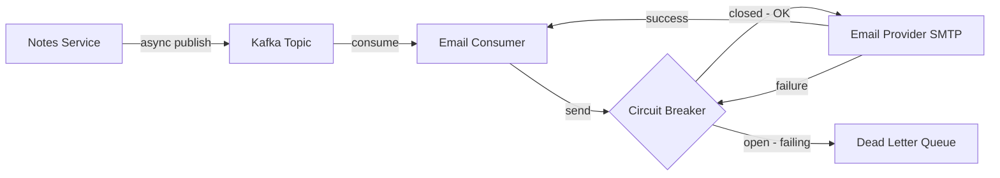

# Task: Async Email Delivery with Kafka

**Related Issue:** #152  
**Category:** Microservices  
**Prerequisites:** task-007-email-service  
**Estimated Time:** 3 hours  
**Notes App Context:** Integrate email events throughout the Notes App's microservices

---

## Learning Objectives

- Integrate email events into the full Notes App event flow
- Implement circuit breaker for the Email Service
- Test distributed failure scenarios
- Monitor email delivery metrics

---

## Email Events to Implement

| Trigger | Kafka Topic | Template |
|---------|-------------|----------|
| User registration | `user-events` (type: user.registered) | welcome |
| Note shared with user | `note-events` (type: note.shared) | note-shared |
| Password reset | `auth-events` (type: password.reset) | password-reset |
| Failed login (5 attempts) | `auth-events` (type: login.suspicious) | security-alert |

---

## Step-by-Step Instructions

### Step 1: Publish Email Events from Auth Service

```go
// When user registers
kafkaProducer.Produce("user-events", &kafka.Message{
    Value: marshalEvent(EmailEvent{
        Type:     "user.registered",
        ID:       uuid.New().String(),
        UserID:   user.ID,
        Email:    user.Email,
        Template: "welcome",
        Data:     map[string]any{"username": user.Username},
    }),
})
```

### Step 2: Implement Circuit Breaker for SMTP

If the SMTP server is down, the circuit breaker opens and prevents repeated failures:

```go
// Use gobreaker or hystrix-go
cb := gobreaker.NewCircuitBreaker(gobreaker.Settings{
    Name:        "smtp-circuit-breaker",
    MaxRequests: 5,
    Timeout:     30 * time.Second,
    ReadyToTrip: func(counts gobreaker.Counts) bool {
        return counts.ConsecutiveFailures > 5
    },
})

func sendEmail(to, template string, data any) error {
    _, err := cb.Execute(func() (any, error) {
        return nil, smtp.SendMail(...)
    })
    return err
}
```

### Step 3: Simulate Distributed Failures

Test each scenario:

1. **Email Service is down** — Kafka buffers messages; they're processed when service restarts
2. **SMTP server is down** — Circuit breaker opens; messages go to DLQ after retries
3. **Malformed event** — DLQ pattern from task-002 kicks in
4. **Redis is down** — Idempotency fails; implement graceful degradation

### Step 4: Monitor Email Delivery

Add Prometheus metrics to the Email Service:

```go
emailsSentTotal := prometheus.NewCounterVec(
    prometheus.CounterOpts{Name: "emails_sent_total"},
    []string{"template", "status"}, // status: sent, failed, skipped
)

emailDeliveryDuration := prometheus.NewHistogramVec(
    prometheus.HistogramOpts{Name: "email_delivery_duration_seconds"},
    []string{"template"},
)
```

Create a Grafana dashboard showing:
- Emails sent per minute
- Email delivery latency P95
- Error rate
- DLQ message count

---

## Task Checklist

- [ ] User registration triggers welcome email
- [ ] Note sharing triggers notification email
- [ ] Circuit breaker implemented for SMTP
- [ ] Distributed failure scenarios tested
- [ ] Prometheus metrics for email delivery
- [ ] Grafana dashboard created

---

**Task Status:** [ ] Not Started | [ ] In Progress | [ ] Completed

---

## Diagram



---

## Automation Reference

> The steps above are **manual/raw** — they teach you the concept by doing it yourself.  
> The `automation/` directory contains the production-grade IaC equivalent:

| What | Where | Description |
|------|-------|-------------|
| Notes App Role | [`automation/ansible/roles/notes-app/`](../../automation/ansible/roles/notes-app/) | Deploys the Notes Service configured to publish async Kafka events |
| Kubernetes Role | [`automation/ansible/roles/kubernetes/`](../../automation/ansible/roles/kubernetes/) | Manages deployments for Kafka, Email Consumer, and circuit-breaker config |
| Monitoring Role | [`automation/ansible/roles/monitoring/`](../../automation/ansible/roles/monitoring/) | Grafana dashboard for circuit-breaker state, queue lag, and email error rates |
