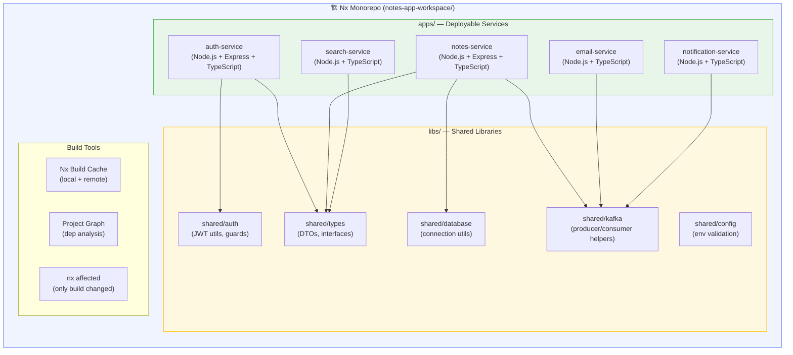

# Task: Microservices - Nx Monorepo for Backend Microservices

**Related Issue:** New (Nx Monorepo Integration)  
**Category:** Microservices  
**Prerequisites:** task-001 (Microservices architecture), task-002 (Database design), Node.js/TypeScript familiarity  
**Estimated Time:** 4–6 hours  
**Notes App Context:** Organize all Notes App microservices (Auth, Notes, Email, Search, Notification) in a single Nx monorepo, enabling shared libraries, unified build caching, and coordinated releases  
**Automation Reference:** [`implementation/microservices/task-009-nx-monorepo/`](../../implementation/microservices/task-009-nx-monorepo/) (starter scaffold)

> 💡 **Manual vs Automated**: This task teaches Nx setup step-by-step.  
> The workspace config and project stubs are in `implementation/microservices/task-009-nx-monorepo/`.

---

## Learning Objectives

By the end of this task, you will be able to:

- Understand what Nx is and why it's used for **backend** microservices (not just frontend)
- Create an Nx workspace with multiple Node.js/TypeScript services
- Share code between microservices using Nx libraries
- Use Nx build caching to speed up CI/CD
- Understand the Nx project graph and affected commands
- Configure Nx targets (build, test, lint, serve) per service
- Integrate Nx into the Notes App CI/CD pipeline (GitHub Actions)

---

## Architecture Diagram

> Where Nx fits in the overall Notes App architecture:



**Full project diagram:** [docs/diagrams/00-big-picture.md](../../docs/diagrams/00-big-picture.md)  
**Standalone Nx diagram:** [docs/diagrams/11-nx-monorepo.md](../../docs/diagrams/11-nx-monorepo.md)

---

## Theory Section

### What is Nx?

**Nx** is a smart build system and monorepo tool made by Nrwl. You've used it with frontend (React/Next.js) before — the good news is **it works equally well for backend Node.js/TypeScript microservices**.

**Key Capabilities:**
- **Monorepo management** — Multiple apps and shared libs in one repo
- **Build caching** — Never rebuild unchanged code (local + remote cache)
- **Affected commands** — Only test/build what actually changed
- **Project graph** — Visual dependency map between services and libraries
- **Code generators** — Scaffold new services/libs consistently
- **Plugin ecosystem** — First-class support for Express, NestJS, Node.js

### Why Nx for Backend Microservices?

**Without Nx (the problem):**
```
notes-app/
├── auth-service/          ← separate repo or folder
│   ├── package.json       ← duplicated dependencies
│   └── src/utils/jwt.ts   ← JWT utils (duplicated in every service)
├── notes-service/
│   ├── package.json       ← duplicated dependencies
│   └── src/utils/jwt.ts   ← same JWT utils, copied again
```

**With Nx (the solution):**
```
notes-app-workspace/
├── apps/
│   ├── auth-service/       ← focuses on auth logic only
│   └── notes-service/      ← focuses on notes logic only
├── libs/
│   └── shared/
│       └── auth/           ← JWT utils here ONCE, imported by all services
└── nx.json
```

**Concrete Benefits for Notes App:**
- `libs/shared/types` → TypeScript interfaces used by Auth, Notes, Search (no duplication)
- `libs/shared/kafka` → Kafka producer/consumer helpers shared across services
- `nx affected --target=test` → In CI, only test services that changed
- `nx build auth-service` → Incremental builds with cache (10x faster CI)
- `nx graph` → Visualize which services depend on which libraries

### Nx vs Separate Repos

| | Nx Monorepo | Separate Repos |
|-|-------------|----------------|
| Shared code | ✅ Easy — just import from `libs/` | ❌ Publish as npm packages |
| Atomic changes | ✅ One PR changes service + shared lib | ❌ Multiple PRs, sync issues |
| Build cache | ✅ Built-in | ❌ Manual setup |
| CI speed | ✅ Only test affected code | ❌ Test everything every time |
| Team scale | ✅ Scales with `--affected` | ✅ Each team owns their repo |
| Complexity | Medium | Low per repo, high across repos |

> **When to use Nx vs separate repos**: Nx is ideal when services share significant code (types, utilities, auth logic). For completely independent services with different teams and different languages (e.g., a Go service and a Python service), separate repos may be better. For the Notes App (all TypeScript, heavy shared types), Nx is the right choice.

### Nx Workspace Structure for Notes App

```
notes-app-workspace/
├── apps/
│   ├── auth-service/           # Authentication microservice
│   ├── notes-service/          # Notes CRUD microservice
│   ├── email-service/          # Email sending via Kafka
│   ├── search-service/         # Full-text search
│   └── notification-service/   # WebSocket notifications
├── libs/
│   └── shared/
│       ├── types/              # DTOs, interfaces, enums
│       ├── auth/               # JWT utils, guards, decorators
│       ├── database/           # DB connection helpers
│       ├── kafka/              # Kafka producer/consumer wrappers
│       └── config/             # Env validation (zod schemas)
├── nx.json                     # Nx configuration
├── package.json                # Root package.json (single node_modules)
└── tsconfig.base.json          # Base TypeScript config (path aliases)
```

### Nx Key Concepts

- **`apps/`** — Deployable units (services). Each becomes a Docker container.
- **`libs/`** — Shared code. Never deployed alone — always imported by apps.
- **`project.json`** — Per-project config (build, test, lint, serve targets).
- **`nx.json`** — Workspace-level config (caching, affected, plugins).
- **`tsconfig.base.json`** — Defines TypeScript path aliases: `@notes-app/shared/types` → `libs/shared/types/src/index.ts`

---

## Prerequisites Check

Before starting, ensure you have:

- [ ] Completed task-001 (Microservices architecture)
- [ ] Node.js 18+ installed (`node --version`)
- [ ] npm 9+ installed (`npm --version`)
- [ ] TypeScript experience (interfaces, generics)
- [ ] Docker installed (for containerizing the services)
- [ ] Familiarity with Express.js (used in the Notes App backend)

---

## Step-by-Step Instructions

### Step 1: Create the Nx Workspace

**Objective:** Bootstrap a new Nx workspace for the Notes App microservices.

```bash
# Create a new Nx workspace
npx create-nx-workspace@latest notes-app-workspace \
  --preset=ts \
  --packageManager=npm \
  --nxCloud=false

cd notes-app-workspace
```

**What this creates:**
```
notes-app-workspace/
├── nx.json
├── package.json
├── tsconfig.base.json
└── .gitignore
```

---

### Step 2: Install Nx Node.js Plugin

**Objective:** Add the `@nx/node` plugin which provides generators and executors for Node.js apps.

```bash
npm install -D @nx/node @nx/js
```

---

### Step 3: Generate the Auth Service

**Objective:** Create the first microservice — the Auth Service.

```bash
npx nx generate @nx/node:app auth-service \
  --directory=apps/auth-service \
  --framework=express \
  --unitTestRunner=jest \
  --e2eTestRunner=none
```

**Expected structure:**
```
apps/auth-service/
├── src/
│   ├── main.ts         ← Express app entry point
│   └── app/
│       └── app.ts
├── project.json        ← Nx project targets
└── tsconfig.app.json
```

**Verify it runs:**
```bash
npx nx serve auth-service
# Visit http://localhost:3333
```

---

### Step 4: Generate Remaining Services

```bash
# Notes Service
npx nx generate @nx/node:app notes-service \
  --directory=apps/notes-service \
  --framework=express \
  --port=3334

# Email Service
npx nx generate @nx/node:app email-service \
  --directory=apps/email-service \
  --framework=none \
  --port=3335

# Search Service
npx nx generate @nx/node:app search-service \
  --directory=apps/search-service \
  --framework=express \
  --port=3336

# Notification Service
npx nx generate @nx/node:app notification-service \
  --directory=apps/notification-service \
  --framework=none \
  --port=3337
```

---

### Step 5: Create Shared Libraries

**Objective:** Create shared TypeScript libraries used by multiple services.

```bash
# Shared TypeScript types (DTOs, interfaces, enums)
npx nx generate @nx/js:lib shared-types \
  --directory=libs/shared/types \
  --importPath=@notes-app/shared/types \
  --bundler=tsc

# Shared auth utilities (JWT, guards)
npx nx generate @nx/js:lib shared-auth \
  --directory=libs/shared/auth \
  --importPath=@notes-app/shared/auth \
  --bundler=tsc

# Shared Kafka helpers
npx nx generate @nx/js:lib shared-kafka \
  --directory=libs/shared/kafka \
  --importPath=@notes-app/shared/kafka \
  --bundler=tsc

# Shared config / env validation
npx nx generate @nx/js:lib shared-config \
  --directory=libs/shared/config \
  --importPath=@notes-app/shared/config \
  --bundler=tsc
```

---

### Step 6: Add Types to Shared Library

**Objective:** Define shared types used by all services.

```typescript
// libs/shared/types/src/lib/note.types.ts
export interface Note {
  id: string;
  title: string;
  content: string;
  userId: string;
  createdAt: Date;
  updatedAt: Date;
}

export interface CreateNoteDto {
  title: string;
  content: string;
}

export interface UpdateNoteDto {
  title?: string;
  content?: string;
}
```

```typescript
// libs/shared/types/src/lib/user.types.ts
export interface User {
  id: string;
  email: string;
  name: string;
  createdAt: Date;
}

export interface CreateUserDto {
  email: string;
  password: string;
  name: string;
}
```

```typescript
// libs/shared/types/src/index.ts
export * from './lib/note.types';
export * from './lib/user.types';
```

---

### Step 7: Import Shared Types in a Service

**Objective:** Show how services import from shared libraries.

```typescript
// apps/notes-service/src/app/notes.controller.ts
import { Note, CreateNoteDto } from '@notes-app/shared/types';  // ← from shared lib

export async function createNote(dto: CreateNoteDto): Promise<Note> {
  // implementation
}
```

> The path alias `@notes-app/shared/types` is configured in `tsconfig.base.json` by Nx automatically.

---

### Step 8: Use Nx Build Commands

```bash
# Build a single service
npx nx build auth-service

# Build all services
npx nx run-many --target=build --all

# Run all tests
npx nx run-many --target=test --all

# ONLY build/test what changed (for CI)
npx nx affected --target=build
npx nx affected --target=test

# Visualize the project dependency graph
npx nx graph
```

---

### Step 9: Create Dockerfiles for Each Service

**Objective:** Each Nx app becomes a Docker container.

```dockerfile
# apps/auth-service/Dockerfile
FROM node:20-alpine AS builder
WORKDIR /workspace
COPY package*.json ./
COPY tsconfig.base.json ./
COPY nx.json ./
COPY apps/auth-service ./apps/auth-service
COPY libs ./libs
RUN npm ci
RUN npx nx build auth-service --prod

FROM node:20-alpine AS runner
WORKDIR /app
COPY --from=builder /workspace/dist/apps/auth-service .
RUN npm ci --only=production
EXPOSE 3333
CMD ["node", "main.js"]
```

```bash
# Build the Docker image
docker build -f apps/auth-service/Dockerfile -t notes-app/auth-service:latest .

# Run it
docker run -p 3333:3333 notes-app/auth-service:latest
```

---

### Step 10: Configure GitHub Actions for Nx Affected

**Objective:** Only build and test what changed in CI.

```yaml
# .github/workflows/ci.yml
name: CI

on:
  push:
    branches: [main, develop]
  pull_request:

jobs:
  build-test:
    runs-on: ubuntu-latest
    steps:
      - uses: actions/checkout@v4
        with:
          fetch-depth: 0  # Required for nx affected

      - name: Setup Node.js
        uses: actions/setup-node@v4
        with:
          node-version: 20
          cache: npm

      - name: Install dependencies
        run: npm ci

      - name: Nx affected — lint
        run: npx nx affected --target=lint --base=origin/main --head=HEAD

      - name: Nx affected — test
        run: npx nx affected --target=test --base=origin/main --head=HEAD

      - name: Nx affected — build
        run: npx nx affected --target=build --base=origin/main --head=HEAD
```

---

## Notes App Specifics

### How This Applies to the Notes App

**Before Nx (current state):**
- The Notes App backend is a monolith (or separate services without shared tooling)
- Code duplication: JWT validation logic copied between services
- No unified build system

**After Nx:**
- All 5 microservices live in one Nx workspace
- Shared types eliminate duplication
- `nx affected` makes CI 3–5x faster
- `nx graph` shows team members how services depend on each other

**Migration Path (existing code → Nx workspace):**
1. Create the Nx workspace (Step 1)
2. Move existing service code into `apps/auth-service/src/`, etc.
3. Extract shared code into `libs/shared/`
4. Update imports to use `@notes-app/shared/types`
5. Update Dockerfiles to build from workspace root

---

## Verification

### Verify Nx Workspace

```bash
# Show all projects
npx nx show projects

# Show project details
npx nx show project auth-service

# Visualize the graph
npx nx graph

# Run all tests
npx nx run-many --target=test --all

# Build all services
npx nx run-many --target=build --all
```

**Expected output from `npx nx show projects`:**
```
auth-service
notes-service
email-service
search-service
notification-service
shared-types
shared-auth
shared-kafka
shared-config
```

---

## Troubleshooting

### `Cannot find module '@notes-app/shared/types'`

The path alias isn't configured. Check `tsconfig.base.json`:
```json
{
  "compilerOptions": {
    "paths": {
      "@notes-app/shared/types": ["libs/shared/types/src/index.ts"]
    }
  }
}
```

### `nx affected` builds everything

Make sure `fetch-depth: 0` is set in the GitHub Actions `checkout` step. Without full git history, Nx can't determine what changed.

### Circular dependency detected

Run `npx nx graph` to visualize the dependency. Libraries should never depend on apps. If you have `lib A → lib B → lib A`, extract the shared part into a new `lib C`.

---

## Best Practices

- **Apps = deployable units** — only apps get Dockerfiles and Kubernetes deployments
- **Libs = shared code** — never import one app from another app (go via a lib)
- **One lib per concern** — `shared/types`, `shared/auth`, `shared/kafka` (not one giant `shared`)
- **Use `@scope/name` imports** — always import via `@notes-app/shared/types`, never via relative `../../libs/`
- **Keep libs pure** — libs should not have side effects (no DB connections, no HTTP calls)
- **Tag projects** — use Nx tags (`type:app`, `type:lib`, `scope:auth`) to enforce constraints

---

## Additional Resources

- [Nx official docs — Node.js](https://nx.dev/nx-api/node)
- [Nx — Organizing Monorepos](https://nx.dev/concepts/decisions/project-dependency-rules)
- [Nx — Affected Commands](https://nx.dev/features/run-tasks#run-tasks-affected-by-a-pr)
- [Nx — Module Federation (advanced)](https://nx.dev/concepts/module-federation/faster-builds)

---

## Next Steps

1. **Complete Nx Setup** → follow steps 1–10 above
2. **Migrate existing code** → move current backend code into the Nx workspace
3. **Add service mesh** → `tasks/service-mesh/` (Nx helps because all services are in one place)
4. **Configure Nx remote cache** → Nx Cloud for shared CI cache across team

---

## Automation Reference

> The steps above are **manual/raw** — they teach you Nx setup by doing it yourself.

| What | Where | Description |
|------|-------|-------------|
| Nx starter scaffold | [`implementation/microservices/task-009-nx-monorepo/`](../../implementation/microservices/task-009-nx-monorepo/) | `nx.json`, `tsconfig.base.json`, example `project.json` per service |
| Deploy services to K8s | [`automation/ansible/roles/notes-app/`](../../automation/ansible/roles/notes-app/) | Helm-based deployment of all services |
| Build containers in CI | [`automation/terraform/modules/ecr/`](../../automation/terraform/modules/ecr/) | ECR registry for Docker images |

> 💡 The Nx workspace produces the Docker images. The Ansible role deploys them to Kubernetes. The Terraform ECR module stores them.

---

## Task Checklist

- [ ] Read and understood the theory section
- [ ] Viewed the architecture diagram above
- [ ] Completed all prerequisite checks
- [ ] Created Nx workspace (Step 1–2)
- [ ] Generated all 5 services (Steps 3–4)
- [ ] Created shared libraries (Step 5–6)
- [ ] Successfully imported shared types in a service (Step 7)
- [ ] Used `nx affected` commands (Step 8)
- [ ] Created Dockerfiles for at least one service (Step 9)
- [ ] Configured GitHub Actions for Nx (Step 10)
- [ ] Ran `npx nx graph` and understood the project graph
- [ ] Verified all services build successfully
- [ ] Documented learnings

---

**Task Status:** [ ] Not Started | [ ] In Progress | [ ] Completed  
**Date Started:** ___  
**Date Completed:** ___
