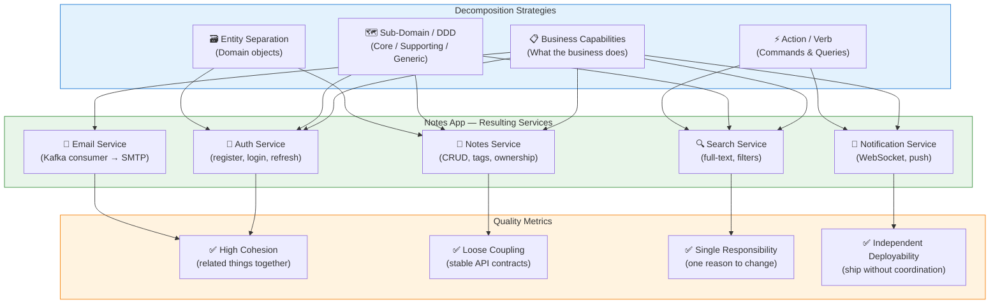

# Task: Microservices Decomposition Strategies

**Related Issue:** [#160 — Microservices Decomposition](../../issues/issue-160.md)  
**Category:** Microservices  
**Prerequisites:** task-001 (Microservices architecture), task-002 (Database design), DDD basics  
**Estimated Time:** 3–5 hours  
**Languages:** TypeScript / Node.js  
**Notes App Context:** Decide the correct service boundaries for the Notes App before writing any code — choosing the wrong boundaries is the most expensive mistake in microservices design  
**Automation Reference:** [`implementation/microservices/task-010-decomposition/`](../../implementation/microservices/task-010-decomposition/)

> 💡 **Manual vs Automated**: This task is primarily analytical and design-focused.  
> Code examples demonstrate resulting service APIs, not the decomposition process itself.

---

## Learning Objectives

By the end of this task, you will be able to:

- Apply and compare four decomposition strategies (business capabilities, sub-domains, entities, actions)
- Identify bounded contexts in any domain using Domain-Driven Design (DDD)
- Measure cohesion and coupling in a proposed decomposition
- Avoid the "distributed monolith" anti-pattern
- Apply Conway's Law to align service boundaries with team structure
- Produce a final decomposition diagram for the Notes App microservices

---

## Diagram



**Full architecture diagram:** [docs/diagrams/00-big-picture.md](../../docs/diagrams/00-big-picture.md)

---

## Theory Section

### Why Decomposition Is Hard

Decomposition is a **one-way door**: the wrong boundaries lead to chatty services (hundreds of inter-service calls per request), data ownership conflicts (two services sharing one DB table), and deployment coupling (you can't release Service A without also releasing Service B). Getting it right upfront is the highest-leverage decision in a microservices project.

**The Distributed Monolith Anti-Pattern:**

```
❌ Distributed Monolith (wrong)
┌─────────────────────────────────────────┐
│ UserService → NoteService → TagService  │
│       (all share the same database!)    │
│       (chatty synchronous HTTP calls)   │
└─────────────────────────────────────────┘
Looks like microservices. Behaves like a monolith.
All services must be deployed together anyway.
```

```
✅ Real Microservices (right)
┌────────────────┐  event  ┌──────────────────┐
│  Notes Service │ ──────→ │ Notification Svc │
│  (owns notes   │         │ (owns push state) │
│   DB table)    │         └──────────────────┘
└────────────────┘
Each service owns its data. Communicates via events.
Can be deployed, scaled, and failed independently.
```

---

### Strategy 1: Business Capabilities

Decompose based on **what the business does** — the stable, high-level activities of the organisation.

**Notes App Business Capabilities:**

| Capability | Service | Responsibility |
|------------|---------|----------------|
| Identity & Access | Auth Service | Register, login, JWT issuance, token refresh |
| Content Management | Notes Service | Create, read, update, delete notes and tags |
| Information Retrieval | Search Service | Full-text search, filters, ranking |
| User Engagement | Notification Service | Real-time WebSocket push, email alerts |
| Communication | Email Service | Transactional email via SMTP/SendGrid |

**Why it works:** Business capabilities are stable. The technology changes, the team changes — but "the business manages notes" rarely changes. Services built around capabilities naturally align with team ownership (Conway's Law).

---

### Strategy 2: DDD Sub-Domain Separation

Domain-Driven Design classifies sub-domains into three types:

| Type | Description | Notes App Example |
|------|-------------|-------------------|
| **Core Domain** | Primary competitive advantage — invest most here | Notes Management (the unique value) |
| **Supporting Sub-domain** | Necessary but not differentiating | Auth, Search |
| **Generic Sub-domain** | Commodity — buy/outsource if possible | Email (SendGrid), Payments (Stripe) |

**Bounded Contexts in the Notes App:**

```
┌──────────────────────────────────────────────────────────┐
│ CORE DOMAIN: Note Management                             │
│   - Note aggregate (id, title, content, userId, tags)    │
│   - Tag value object                                     │
│   - NoteRepository                                       │
└──────────────────────────────────────────────────────────┘
         │ Anti-Corruption Layer (ACL)
         ↓
┌──────────────────────────────────────────────────────────┐
│ SUPPORTING: Authentication Context                       │
│   - User aggregate (id, email, passwordHash)             │
│   - Token value object                                   │
│   - "User" here = credentials, NOT the whole user profile│
└──────────────────────────────────────────────────────────┘
```

> Note: The word "User" means different things in different bounded contexts. In Auth, `User = {id, email, passwordHash}`. In Notes, `User = {id}` (just a foreign key). Do NOT share a `User` entity between bounded contexts — this creates coupling.

---

### Strategy 3: Entity Separation

Decompose by **primary domain objects**. Each service owns one aggregate root.

| Entity | Service | Owns |
|--------|---------|------|
| User | User Service | users table, password resets |
| Note | Note Service | notes table, tags |
| Notification | Notification Service | notification_log table |

**Limitation:** This approach tends toward anemic CRUD services. A `UserService` that does nothing but `createUser / getUser / updateUser` has no encapsulated business logic — it's just a database wrapper. Better combined with business capability decomposition.

---

### Strategy 4: Action/Verb Separation (CQRS)

Decompose by **what happens** — commands (writes) and queries (reads) are different services.

```
┌─────────────────────┐    ┌────────────────────┐
│   Write API          │    │    Read API         │
│  POST /notes         │    │  GET /notes         │
│  PUT /notes/:id      │    │  GET /notes/search  │
│  DELETE /notes/:id   │    │  GET /notes/:id     │
└─────────────────────┘    └────────────────────┘
      │                              ↑
      │ (events via Kafka)           │ (read from
      └──────────────────────────────┘  read replica / Redis)
```

**Best for:** High-scale read-heavy systems where read and write traffic need independent scaling. The Notes App can apply this within the Notes Service (CQRS inside the service boundary).

---

### Cohesion & Coupling Metrics

Use these heuristics to evaluate any proposed decomposition:

| Metric | Good Sign | Bad Sign |
|--------|-----------|----------|
| **Cohesion** | All code in service relates to one purpose | Service has unrelated features bundled together |
| **Coupling** | Service communicates via events or stable REST APIs | Service shares a DB table with another service |
| **Change frequency** | All code in service changes for the same reason | Module A changes every week; Module B never changes |
| **Deployment independence** | Service can be released without coordinating others | Releasing requires simultaneous deploy of 3 services |
| **Team ownership** | One team owns one service end-to-end | Multiple teams must approve changes to one service |

---

## Prerequisites Check

- [ ] Completed task-001 (Microservices architecture overview)
- [ ] Completed task-002 (Database design per service)
- [ ] Basic understanding of Domain-Driven Design concepts
- [ ] Node.js / TypeScript experience
- [ ] Docker and Docker Compose installed

---

## Step-by-Step Instructions

### Step 1: Map the Notes App Domain

**Objective:** Identify all the things the Notes App does before choosing service boundaries.

Create a domain map using Event Storming (simplified):

```
Events (things that happened):
  UserRegistered → UserLoggedIn → NoteCreated → NoteUpdated
  NoteDeleted → NoteSearched → NotificationSent → EmailSent

Commands (things users do):
  RegisterUser, LoginUser, CreateNote, UpdateNote,
  DeleteNote, SearchNotes, SubscribeToNotifications

Aggregates (things that own state):
  User, Note, Notification, EmailDelivery
```

**Exercise:** On paper or a whiteboard, draw a timeline of events and group related events. Groups become candidate service boundaries.

---

### Step 2: Apply Business Capability Decomposition

**Objective:** Define the Notes App services using business capabilities.

```typescript
// services/auth-service/src/routes/auth.routes.ts
// Auth Service owns: register, login, token refresh, logout
import { Router } from 'express';
const router = Router();

router.post('/register', registerHandler);
router.post('/login', loginHandler);
router.post('/refresh', refreshTokenHandler);
router.post('/logout', logoutHandler);

export default router;
```

```typescript
// services/notes-service/src/routes/notes.routes.ts
// Notes Service owns: CRUD for notes, tagging
router.post('/notes', createNoteHandler);
router.get('/notes', listNotesHandler);
router.get('/notes/:id', getNoteHandler);
router.put('/notes/:id', updateNoteHandler);
router.delete('/notes/:id', deleteNoteHandler);
```

```typescript
// services/search-service/src/routes/search.routes.ts
// Search Service owns: full-text search over notes
router.get('/search', searchNotesHandler);
// search-service has a READ-ONLY replica or search index (Elasticsearch)
// it does NOT own the notes table — it subscribes to NoteCreated events
```

---

### Step 3: Define Service Contracts (API Contracts)

**Objective:** Write explicit API contracts before implementation — the contract is what other services depend on, not the implementation.

```typescript
// shared/types/src/lib/service-contracts.ts

// Auth Service contract
export interface AuthServiceContract {
  'POST /auth/register': {
    body: { email: string; password: string; name: string };
    response: { userId: string; token: string };
  };
  'POST /auth/verify': {
    body: { token: string };
    response: { userId: string; email: string } | { error: string };
  };
}

// Notes Service contract
export interface NotesServiceContract {
  'POST /notes': {
    body: { title: string; content: string };
    headers: { Authorization: string };
    response: { id: string; title: string; content: string; createdAt: string };
  };
}
```

> Writing contracts before code prevents tight coupling. Any service can change its internals as long as it honours its contract.

---

### Step 4: Validate Decomposition Against Metrics

**Objective:** Score your proposed decomposition against the cohesion/coupling metrics.

```bash
# Exercise: Answer these questions for each service you've defined:

# 1. Cohesion check
# - Does every endpoint in this service relate to the SAME business capability?
# - If you removed one endpoint, would it belong in a different service?

# 2. Coupling check
# - Does this service share a database TABLE with another service? (❌ if yes)
# - Does this service call another service synchronously more than 2x per request? (⚠️ if yes)
# - Can this service be deployed without touching any other service? (✅ if yes)

# 3. Conway's Law check
# - Does one team own this service end-to-end?
# - Is the team responsible for on-call for this service?
```

**Notes App Decomposition Scorecard:**

| Service | Cohesion | Coupling | Single Responsibility | Independent Deploy |
|---------|----------|----------|-----------------------|--------------------|
| Auth Service | ✅ | ✅ | ✅ | ✅ |
| Notes Service | ✅ | ✅ | ✅ | ✅ |
| Search Service | ✅ | ✅ (event-driven) | ✅ | ✅ |
| Notification Service | ✅ | ✅ (event-driven) | ✅ | ✅ |
| Email Service | ✅ | ✅ (Kafka) | ✅ | ✅ |

---

### Step 5: Document the Decomposition Decision

**Objective:** Create an Architecture Decision Record (ADR) for your decomposition choice.

```markdown
# ADR-001: Microservices Decomposition Strategy for Notes App

## Status: Accepted

## Context
The Notes App is growing and needs to scale different parts independently.
We evaluated 4 decomposition strategies.

## Decision
We use **Business Capability decomposition** as the primary strategy,
validated against DDD bounded contexts.

## Services
- Auth Service (Identity & Access capability)
- Notes Service (Content Management capability — core domain)
- Search Service (Information Retrieval capability — supporting subdomain)
- Notification Service (User Engagement capability — supporting subdomain)
- Email Service (Communication capability — generic subdomain → candidate for outsourcing)

## Consequences
- Each service has a dedicated PostgreSQL schema (no shared tables)
- Cross-service communication uses Kafka events (NoteCreated, NoteUpdated) for async
- Synchronous calls (e.g., Notes Service validating a JWT) go through Auth Service API
- Search Service is NOT a direct clone of the Notes DB — it subscribes to events and builds its own search index
```

---

## Verification

```bash
# Verify each service has a single, focused responsibility:
# 1. List all routes in each service
grep -r "router\." services/auth-service/src --include="*.ts"
grep -r "router\." services/notes-service/src --include="*.ts"

# 2. Verify no shared database tables (each service has its own schema)
# Check docker-compose.yml — each service should connect to its own DB

# 3. Verify services communicate via events, not shared DB
grep -r "kafka" services/notes-service/src --include="*.ts"
# Should see Kafka producer for NoteCreated events

# 4. Deploy one service and verify others still work
docker compose stop auth-service
# Notes service should still serve existing requests (may fail auth of new ones, but shouldn't crash)
```

---

## Task Checklist

- [ ] Read and understood all four decomposition strategies
- [ ] Completed the Event Storming exercise (Step 1)
- [ ] Applied Business Capability decomposition to Notes App (Step 2)
- [ ] Defined API contracts for at least 2 services (Step 3)
- [ ] Scored decomposition against cohesion/coupling metrics (Step 4)
- [ ] Written an ADR documenting the decomposition decision (Step 5)
- [ ] Identified at least one candidate for DDD "Generic Subdomain" (outsource/buy)
- [ ] Verified no shared database tables across services
- [ ] Reviewed diagram above and can explain each arrow

---

## Automation Reference

> The steps above teach decomposition by doing it manually. The automation tools help deploy the resulting services.

| What | Where | Description |
|------|-------|-------------|
| Deploy services to Kubernetes | [`automation/terraform/modules/eks/`](../../automation/terraform/modules/eks/) | EKS cluster where all decomposed services run |
| Container image registry | [`automation/terraform/modules/ecr/`](../../automation/terraform/modules/ecr/) | ECR repository per service (one repo per microservice) |
| Deploy Notes App services | [`automation/ansible/roles/notes-app/`](../../automation/ansible/roles/notes-app/) | Ansible role that deploys all microservices to K8s |
| Service implementation stubs | [`implementation/microservices/task-010-decomposition/`](../../implementation/microservices/task-010-decomposition/) | Starter scaffold with service directory structure |

> 💡 After completing this task, use the ECR module to create one image repository per service, and the notes-app Ansible role to deploy them to the EKS cluster provisioned by the eks module.

---

**Task Status:** [ ] Not Started | [ ] In Progress | [ ] Completed  
**Date Started:** ___  
**Date Completed:** ___
