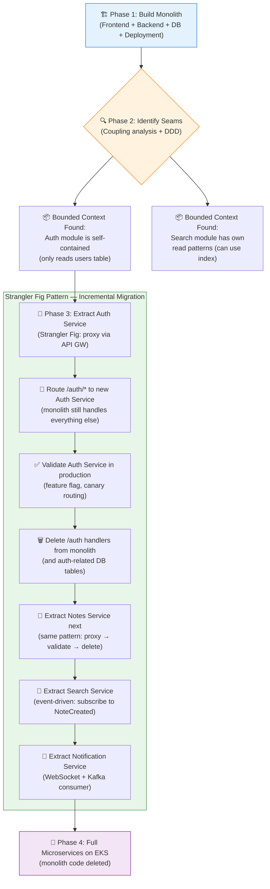

# Task: Monolith First, Then Migrate to Microservices

**Related Issue:** [#161 — Monolith First then Convert to Microservices](../../issues/issue-161.md)  
**Category:** Microservices  
**Prerequisites:** task-001 through task-009, Docker Compose, basic Kubernetes, task-010 (Decomposition strategies)  
**Estimated Time:** 8–12 hours (spread across multiple sessions)  
**Languages:** TypeScript / Node.js, React, SQL  
**Notes App Context:** Build the complete Notes App as a monolith first (frontend + backend + DB + deployment), then incrementally migrate it to microservices using the Strangler Fig pattern — exactly as real companies do  
**Automation Reference:** [`implementation/microservices/task-011-monolith-to-microservices/`](../../implementation/microservices/task-011-monolith-to-microservices/)

> 💡 **Phased approach**: This is a multi-session task. Complete Phase 1 (Monolith) fully before starting Phase 2 (Migration). Do not shortcut the monolith phase — operating a real monolith is what teaches you where to split it.

---

## Learning Objectives

By the end of this task, you will be able to:

- Build a complete, production-grade monolithic Notes App with all layers (frontend, backend, database, cache, deployment)
- Apply system design best practices to the monolith (connection pooling, health checks, structured logging, caching)
- Identify natural seams in the monolith using coupling metrics and DDD bounded contexts
- Implement the **Strangler Fig pattern** with an API Gateway to incrementally extract services
- Split the database one schema at a time during migration
- Deploy the hybrid (monolith + extracted services) to Kubernetes without downtime
- Complete the migration and decommission the monolith

---

## Diagram



**Full architecture diagram:** [docs/diagrams/00-big-picture.md](../../docs/diagrams/00-big-picture.md)

---

## Theory Section

### Why Monolith First?

Martin Fowler: *"Don't start a new project with microservices."*

The fundamental problem with starting with microservices is **you don't yet know your domain**. You'll draw the wrong boundaries, create a distributed monolith (services that look independent but are tightly coupled), and spend 80% of your time on infrastructure instead of business logic.

**What a monolith gives you:**
- Fast iteration: a single `npm run dev` starts everything
- Easy refactoring: rename a function — it's a single codebase
- Simple debugging: one log stream, one stack trace
- Operational simplicity: one deployment, one health check
- Time to understand which parts actually need to scale independently

**What the monolith teaches you before migration:**
1. Which modules are called most frequently (scale candidates)
2. Which modules are responsible for the most incidents (isolation candidates)
3. Which modules teams argue about (Conway's Law boundary candidates)
4. Where shared data makes splitting hard (database seam complexity)

---

### The Strangler Fig Pattern

Named after the strangler fig tree: it grows around the host tree, eventually replacing it completely — the host tree dies and the strangler becomes the new tree.

**How it works:**

```
Step 1: Add API Gateway in front of monolith (no functional change)
         Client → API Gateway → Monolith

Step 2: Extract Auth Service. Proxy /auth/* routes to it.
         Client → API Gateway → /auth/* → Auth Service (new)
                            → /notes/* → Monolith (old)

Step 3: Validate Auth Service in production with canary routing
         (5% traffic to new service, 95% to monolith, compare responses)

Step 4: Switch 100% traffic to Auth Service. Delete auth code from monolith.
         Client → API Gateway → /auth/* → Auth Service ✅
                            → /notes/* → Monolith (shrinking)

Step 5: Repeat for Notes Service, Search Service, etc.

Step 6: Monolith code is fully deleted. All traffic goes to microservices.
```

**Why not just rewrite from scratch?**  
The "Big Bang Rewrite" is one of the highest-risk engineering decisions possible. Joel Spolsky called it "the single worst strategic mistake any software company can make." The Strangler Fig avoids this by running old and new code simultaneously — you can always roll back by re-routing traffic to the monolith.

---

### Phase 1: Modular Monolith Architecture

Build the monolith with **module boundaries from day one**. A modular monolith has explicit interfaces between modules — this is what makes migration possible later.

```
notes-monolith/
├── src/
│   ├── modules/
│   │   ├── auth/
│   │   │   ├── auth.service.ts     ← business logic
│   │   │   ├── auth.routes.ts      ← HTTP handlers
│   │   │   ├── auth.repository.ts  ← DB queries
│   │   │   └── auth.types.ts       ← interfaces (no external imports)
│   │   ├── notes/
│   │   │   ├── notes.service.ts
│   │   │   ├── notes.routes.ts
│   │   │   ├── notes.repository.ts
│   │   │   └── notes.types.ts
│   │   ├── search/
│   │   │   ├── search.service.ts
│   │   │   └── search.routes.ts
│   │   └── notifications/
│   │       ├── notification.service.ts
│   │       └── notification.routes.ts
│   ├── shared/
│   │   ├── database.ts     ← single DB connection pool
│   │   ├── redis.ts        ← single Redis client
│   │   ├── logger.ts       ← structured logging (Winston)
│   │   └── middleware/
│   │       ├── auth.middleware.ts
│   │       └── error.middleware.ts
│   └── app.ts              ← Express app composition
├── Dockerfile
└── docker-compose.yml
```

> The key rule: **modules may not import from each other's internals**. `notes.service.ts` cannot import from `auth.repository.ts`. It can only call `auth.service.ts` (the module's public interface). This is what creates extractable seams.

---

### Database Schema Design for Future Migration

Design the database with future splits in mind — give each module its own schema namespace, even within the single PostgreSQL instance:

```sql
-- Auth module tables (will become Auth Service DB)
CREATE SCHEMA auth_schema;
CREATE TABLE auth_schema.users (
  id UUID PRIMARY KEY DEFAULT gen_random_uuid(),
  email TEXT UNIQUE NOT NULL,
  password_hash TEXT NOT NULL,
  created_at TIMESTAMPTZ DEFAULT now()
);
CREATE TABLE auth_schema.refresh_tokens (
  token_hash TEXT PRIMARY KEY,
  user_id UUID REFERENCES auth_schema.users(id),
  expires_at TIMESTAMPTZ NOT NULL
);

-- Notes module tables (will become Notes Service DB)
CREATE SCHEMA notes_schema;
CREATE TABLE notes_schema.notes (
  id UUID PRIMARY KEY DEFAULT gen_random_uuid(),
  user_id UUID NOT NULL,  -- ← No FK to auth_schema.users (intentional!)
  title TEXT NOT NULL,
  content TEXT NOT NULL,
  created_at TIMESTAMPTZ DEFAULT now()
);

-- No cross-schema foreign keys! This is intentional.
-- It means the tables can be moved to separate databases later.
```

> **Critical rule:** No cross-schema foreign keys. The `notes_schema.notes.user_id` column does NOT have a foreign key constraint to `auth_schema.users.id`. This seems wrong but is essential for future migration — you can't move a table to a separate database if it has FK constraints to another database.

---

### Database Migration Strategy

When extracting a service, the database must be split too. This is the hardest part.

```
Migration steps for extracting Auth Service DB:

1. Dual-write phase:
   - Monolith writes to auth_schema (existing)
   - Auth Service writes to auth_service_db (new, separate Postgres instance)
   - Both are kept in sync via event (UserCreated, UserUpdated)

2. Read migration:
   - Switch Auth Service reads to auth_service_db
   - Validate data consistency

3. Cutover:
   - Stop dual-write
   - Auth Service owns auth_service_db
   - Drop auth_schema from monolith DB

4. Cleanup:
   - Remove auth-related tables from monolith DB
   - Remove auth-related code from monolith
```

---

## Prerequisites Check

- [ ] Completed task-001 through task-009 (or review them)
- [ ] Completed task-010 (Decomposition strategies)
- [ ] Node.js 20+, Docker, Docker Compose installed
- [ ] PostgreSQL and Redis available (via Docker)
- [ ] Basic React knowledge (for the frontend phase)
- [ ] kubectl and basic Kubernetes knowledge (for migration phase)

---

## Step-by-Step Instructions

### Step 1: Build the Monolith Backend

**Objective:** Create a complete, production-grade Express.js monolith with all modules.

```bash
mkdir notes-monolith && cd notes-monolith
npm init -y
npm install express pg redis ioredis jsonwebtoken bcrypt winston zod
npm install -D typescript @types/express @types/pg @types/node ts-node nodemon
```

```typescript
// src/shared/database.ts
import { Pool } from 'pg';

const pool = new Pool({
  host: process.env.DB_HOST || 'localhost',
  port: Number(process.env.DB_PORT) || 5432,
  database: process.env.DB_NAME || 'notes_db',
  user: process.env.DB_USER || 'postgres',
  password: process.env.DB_PASSWORD || 'postgres',
  max: 20,                    // connection pool size
  idleTimeoutMillis: 30_000,
  connectionTimeoutMillis: 2_000,
});

// Health check
pool.query('SELECT 1').catch((err) => {
  console.error('Database connection failed:', err);
  process.exit(1);
});

export default pool;
```

```typescript
// src/modules/auth/auth.service.ts
import bcrypt from 'bcrypt';
import jwt from 'jsonwebtoken';
import pool from '../../shared/database';

const JWT_SECRET = process.env.JWT_SECRET || 'dev-secret-change-in-prod';

export async function register(email: string, password: string, name: string) {
  const passwordHash = await bcrypt.hash(password, 12);
  const result = await pool.query(
    `INSERT INTO auth_schema.users (email, password_hash, name)
     VALUES ($1, $2, $3) RETURNING id, email, name`,
    [email, passwordHash, name]
  );
  return result.rows[0];
}

export async function login(email: string, password: string) {
  const result = await pool.query(
    'SELECT * FROM auth_schema.users WHERE email = $1',
    [email]
  );
  const user = result.rows[0];
  if (!user || !(await bcrypt.compare(password, user.password_hash))) {
    throw new Error('Invalid credentials');
  }
  const token = jwt.sign({ userId: user.id, email: user.email }, JWT_SECRET, {
    expiresIn: '15m',
  });
  return { token, userId: user.id };
}

export function verifyToken(token: string) {
  return jwt.verify(token, JWT_SECRET) as { userId: string; email: string };
}
```

---

### Step 2: Add Docker Compose for Full Stack

**Objective:** Run the complete monolith stack with one command.

```yaml
# docker-compose.yml
version: '3.8'

services:
  postgres:
    image: postgres:16-alpine
    environment:
      POSTGRES_DB: notes_db
      POSTGRES_USER: postgres
      POSTGRES_PASSWORD: postgres
    ports:
      - "5432:5432"
    volumes:
      - postgres_data:/var/lib/postgresql/data
      - ./db/init.sql:/docker-entrypoint-initdb.d/init.sql

  redis:
    image: redis:7-alpine
    ports:
      - "6379:6379"

  backend:
    build: .
    ports:
      - "3000:3000"
    environment:
      DB_HOST: postgres
      DB_NAME: notes_db
      DB_USER: postgres
      DB_PASSWORD: postgres
      REDIS_URL: redis://redis:6379
      JWT_SECRET: change-me-in-production
    depends_on:
      - postgres
      - redis

  frontend:
    build: ./frontend
    ports:
      - "8080:80"
    environment:
      REACT_APP_API_URL: http://backend:3000

volumes:
  postgres_data:
```

```bash
docker compose up -d
docker compose ps    # verify all services are healthy
curl http://localhost:3000/health  # should return {"status":"ok"}
```

---

### Step 3: Add API Gateway (Strangler Fig Preparation)

**Objective:** Add an Nginx API Gateway in front of the monolith — no routing changes yet, but the infrastructure for strangler fig is in place.

```nginx
# nginx/nginx.conf
events { worker_processes 1; }

http {
  upstream monolith {
    server backend:3000;
  }

  # Placeholder upstreams for future services
  # upstream auth_service { server auth-service:3001; }
  # upstream notes_service { server notes-service:3002; }

  server {
    listen 80;

    # Currently: all traffic goes to monolith
    location / {
      proxy_pass http://monolith;
      proxy_set_header Host $host;
      proxy_set_header X-Real-IP $remote_addr;
    }

    # Health check endpoint
    location /nginx-health {
      return 200 'healthy\n';
    }
  }
}
```

```yaml
# Add to docker-compose.yml
  api-gateway:
    image: nginx:alpine
    ports:
      - "80:80"
    volumes:
      - ./nginx/nginx.conf:/etc/nginx/nginx.conf:ro
    depends_on:
      - backend
```

---

### Step 4: Identify Seams in the Monolith

**Objective:** Analyse the monolith to find natural split points before extracting services.

```bash
# Seam analysis checklist:

# 1. Module communication map
# Draw: which modules call which other modules?
# auth.service.ts imports from: shared/database only ✅ (clean seam!)
# notes.service.ts imports from: shared/database, shared/redis ✅
# notes.service.ts calls auth.service.verifyToken ⚠️ (will become HTTP call)

# 2. Database schema isolation check
# List all tables used by each module:
psql -c "\dt auth_schema.*"   # auth module's tables
psql -c "\dt notes_schema.*"  # notes module's tables
# Verify: no cross-schema queries in module code

# 3. Change frequency analysis
# git log --oneline src/modules/auth/    # how often does auth change?
# git log --oneline src/modules/notes/   # how often do notes change?
# If auth changes 1x/month and notes change 10x/month → strong split signal

# 4. Scaling requirements
# auth service: stateless, lightweight → scale if needed
# notes service: DB-heavy, cacheable → scale independently
# search service: read-heavy, Elasticsearch-worthy → strong isolation signal
```

---

### Step 5: Extract the Auth Service (Strangler Fig)

**Objective:** Extract Auth Service as the first microservice, proxied via API Gateway.

```typescript
// auth-service/src/app.ts — new standalone Auth Service
import express from 'express';
import { register, login, verifyToken } from './auth.service';  // same logic, new process

const app = express();
app.use(express.json());

app.post('/auth/register', async (req, res) => {
  const { email, password, name } = req.body;
  const user = await register(email, password, name);
  res.status(201).json(user);
});

app.post('/auth/login', async (req, res) => {
  const { email, password } = req.body;
  const result = await login(email, password);
  res.json(result);
});

app.get('/auth/verify', (req, res) => {
  const token = req.headers.authorization?.split(' ')[1];
  const payload = verifyToken(token!);
  res.json(payload);
});

app.listen(3001, () => console.log('Auth Service listening on :3001'));
```

```nginx
# nginx.conf — Updated to route /auth/* to Auth Service
upstream auth_service { server auth-service:3001; }
upstream monolith     { server backend:3000; }

location /auth/ {
  proxy_pass http://auth_service;  # ← Now going to Auth Service
}
location / {
  proxy_pass http://monolith;      # ← Everything else still hits monolith
}
```

```bash
# Start Auth Service alongside monolith
docker compose up -d auth-service

# Verify: auth routes go to new service
curl -X POST http://localhost/auth/login \
  -H "Content-Type: application/json" \
  -d '{"email":"test@example.com","password":"password123"}'

# Verify: notes routes still go to monolith
curl http://localhost/notes -H "Authorization: Bearer $TOKEN"
```

---

## Verification

```bash
# Phase 1: Monolith verification
docker compose ps                    # all services healthy
curl http://localhost/health         # returns {"status":"ok"}
curl -X POST http://localhost/auth/register -d '{"email":"a@b.com","password":"pass","name":"Test"}'
curl -X POST http://localhost/auth/login    -d '{"email":"a@b.com","password":"pass"}'
# Use returned JWT token:
curl http://localhost/notes -H "Authorization: Bearer $TOKEN"

# Phase 2: Post-extraction verification
# Auth still works via new service:
docker compose stop backend          # stop monolith
curl -X POST http://localhost/auth/login -d '...' # should still work via Auth Service
docker compose start backend

# Verify Auth Service is handling auth independently:
docker compose logs auth-service | grep "POST /auth/login"
docker compose logs backend | grep "POST /auth/login"  # should NOT appear for this route
```

---

## Task Checklist

- [ ] Read the theory section — understand why monolith first
- [ ] Built the monolith backend with all modules (auth, notes, search, notifications) - Step 1
- [ ] Created Docker Compose stack with postgres, redis, backend, frontend - Step 2
- [ ] Verified full stack works end-to-end (`curl /health`, create note, list notes)
- [ ] Added API Gateway (Nginx) in front of monolith - Step 3
- [ ] Completed seam analysis (drew module communication map) - Step 4
- [ ] Extracted Auth Service and updated Nginx routing - Step 5
- [ ] Verified Auth Service handles `/auth/*` independently
- [ ] Verified monolith still handles all other routes
- [ ] Extracted at least one more service (Notes Service) using the same pattern
- [ ] Reviewed the Strangler Fig diagram and can explain each phase

---

## Automation Reference

> The steps above are manual — they simulate the migration process. The automation tools deploy the result to production.

| What | Where | Description |
|------|-------|-------------|
| Kubernetes cluster | [`automation/terraform/modules/eks/`](../../automation/terraform/modules/eks/) | EKS cluster where both monolith and extracted services run during migration |
| RDS for PostgreSQL | [`automation/terraform/modules/rds/`](../../automation/terraform/modules/rds/) | Separate RDS instance per extracted service (replace Docker Postgres) |
| Container registry | [`automation/terraform/modules/ecr/`](../../automation/terraform/modules/ecr/) | One ECR repo per service: notes-monolith, auth-service, notes-service, etc. |
| App deployment | [`automation/ansible/roles/notes-app/`](../../automation/ansible/roles/notes-app/) | Ansible role that deploys services to K8s — supports both monolith and microservices topologies |
| Implementation stubs | [`implementation/microservices/task-011-monolith-to-microservices/`](../../implementation/microservices/task-011-monolith-to-microservices/) | Starter code for monolith with module boundaries pre-wired |

> 💡 The migration path on Kubernetes: first deploy the monolith to EKS using the notes-app Ansible role. Then provision a new RDS instance with the rds module for the Auth Service. Extract Auth Service to its own ECR repo and deployment. Update the Nginx Ingress to route `/auth/*` to the new deployment.

---

**Task Status:** [ ] Not Started | [ ] In Progress | [ ] Completed  
**Date Started:** ___  
**Date Completed:** ___
