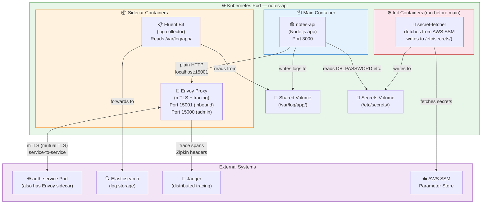

# Task: Sidecar Pattern for Cross-Cutting Concerns

**Related Issue:** [#162 — Sidecar Pattern for Shared Logic](../../issues/issue-162.md)  
**Category:** Microservices  
**Prerequisites:** task-001 (Microservices architecture), Kubernetes basics, Docker multi-container concepts  
**Estimated Time:** 3–5 hours  
**Languages:** YAML (Kubernetes), Dockerfile  
**Notes App Context:** Add logging, mTLS, distributed tracing, and config injection to the Notes App microservices without modifying application code — using sidecar containers in each Kubernetes Pod  
**Automation Reference:** [`implementation/microservices/task-012-sidecar-pattern/`](../../implementation/microservices/task-012-sidecar-pattern/)

> 💡 **Manual vs Automated**: This task teaches Kubernetes multi-container Pods step-by-step.  
> The Kubernetes manifests in `implementation/microservices/task-012-sidecar-pattern/` provide starter YAML.

---

## Learning Objectives

By the end of this task, you will be able to:

- Explain the Sidecar pattern and why it solves cross-cutting concerns without code duplication
- Define a multi-container Kubernetes Pod with a sidecar container
- Configure a **Fluent Bit** sidecar for log forwarding from the Notes API
- Deploy a Pod with an **Envoy** sidecar for transparent mTLS between services
- Write an **Init Container** to inject configuration before the main container starts
- Distinguish between Sidecar, Ambassador, and Adapter container patterns
- Understand how Istio auto-injects Envoy sidecars via a MutatingAdmissionWebhook

---

## Diagram



**Full architecture diagram:** [docs/diagrams/00-big-picture.md](../../docs/diagrams/00-big-picture.md)

---

## Theory Section

### What Is the Sidecar Pattern?

A **sidecar** is a secondary container that runs **in the same Kubernetes Pod** as the primary application container. Because containers in the same Pod share:

- **Network namespace** → they communicate via `localhost` (no DNS, no service discovery)
- **Process namespace** (optionally) → sidecar can observe the main process
- **Storage volumes** → they can share files (e.g., log files, secrets)

This co-location enables the sidecar to transparently intercept, extend, or assist the main application.

**The classic analogy:** A motorcycle sidecar — it's attached to the motorcycle, shares the same journey, but does different work (carries the passenger while the motorcycle carries the driver).

---

### Why Not a Shared Library?

| Approach | Update strategy | Language constraint | Deployment coupling |
|----------|----------------|---------------------|---------------------|
| Shared library (inside the app) | Redeploy ALL services when library changes | Library language = app language | High |
| Sidecar container | Restart only the sidecar container | Sidecar can be any language | None |
| Centralised service | Network call overhead | None | Medium (new network hop) |

**Example:** A bug is found in the mTLS certificate rotation logic. With a shared library, you must update and redeploy all 5 microservices. With Envoy as a sidecar, you update the Envoy image version in the Kubernetes deployment and roll the sidecar — the application containers are untouched.

---

### Three Co-located Container Patterns

All three run as extra containers in a Kubernetes Pod:

| Pattern | Role | Notes App Example |
|---------|------|-------------------|
| **Sidecar** | Extends / assists the main container | Fluent Bit for log collection, Envoy for mTLS |
| **Ambassador** | Proxies outbound traffic to external services | Envoy proxying Notes API calls to a third-party payment API (handles retries, circuit breaking) |
| **Adapter** | Normalises the main container's interface for consumers | Legacy service emitting non-standard log format → adapter converts to JSON for the log pipeline |

---

### Envoy as Sidecar: mTLS Deep Dive

Mutual TLS (mTLS) means **both client and server** present X.509 certificates. Neither side trusts the other without a valid certificate from the same Certificate Authority (CA).

**Without Envoy sidecar (insecure):**
```
Notes API → HTTP → Auth API
(no encryption, no service identity verification)
```

**With Envoy sidecar (mTLS — zero trust):**
```
Notes API (plain HTTP on localhost)
    ↓
Envoy sidecar (intercepts outbound traffic)
    ↓ TLS handshake: presents cert signed by cluster CA
Auth Service Envoy sidecar (verifies cert from cluster CA)
    ↓ plain HTTP on localhost
Auth API application
```

The application code never changes. Both services see plain HTTP. Envoy handles all the TLS — certificate rotation, cipher suite negotiation, certificate revocation.

**Istio auto-injection:** When a Kubernetes namespace has the label `istio-injection=enabled`, the Istio control plane's MutatingAdmissionWebhook automatically adds an Envoy container to every Pod spec at admission time. The developer writes normal Pod YAML — Envoy appears automatically.

---

### Fluent Bit Sidecar: Log Collection

**Without sidecar:** each application must include a logging SDK (Winston, Pino) that ships logs to Elasticsearch or CloudWatch directly. If the endpoint changes, all apps must be updated.

**With Fluent Bit sidecar:** the application writes to a local log file or stdout. Fluent Bit reads those logs and forwards them to any destination — the application is completely decoupled from the log pipeline.

```
Notes API writes: /var/log/app/notes-api.log (shared volume)
Fluent Bit reads: /var/log/app/*.log
Fluent Bit ships: → Elasticsearch + CloudWatch + Datadog simultaneously
```

---

### Init Container: Pre-Start Logic

Init containers **run to completion before the main container starts**. They are ideal for:

1. **Secret injection**: Fetch secrets from AWS SSM or Vault, write to a shared emptyDir volume
2. **Database migration**: Run `npm run migrate` before the API starts (ensures schema is up-to-date)
3. **Dependency waiting**: `wait-for-it.sh postgres:5432` — ensure PostgreSQL is accepting connections
4. **Permission fixing**: `chmod 777 /data` — fix volume permissions before the app user runs

```yaml
initContainers:
  - name: wait-for-postgres
    image: busybox:1.36
    command: ['sh', '-c',
      'until nc -z postgres-service 5432; do echo waiting; sleep 2; done']
  - name: run-migrations
    image: notes-api:latest
    command: ['npm', 'run', 'migrate']
    envFrom:
      - secretRef:
          name: notes-db-credentials
```

---

## Prerequisites Check

- [ ] Kubernetes cluster available (minikube, kind, or EKS)
- [ ] kubectl configured and connected to cluster
- [ ] Docker installed (for building images)
- [ ] Basic understanding of Kubernetes Pods, Deployments, and Services
- [ ] Completed task-001 (Microservices architecture)

---

## Step-by-Step Instructions

### Step 1: Multi-Container Pod with Shared Volume

**Objective:** Define a Pod where the Notes API and Fluent Bit share a log volume.

```yaml
# k8s/notes-api-with-fluent-bit.yaml
apiVersion: v1
kind: Pod
metadata:
  name: notes-api
  labels:
    app: notes-api
spec:
  volumes:
    - name: app-logs
      emptyDir: {}                   # shared between main + sidecar
    - name: fluent-bit-config
      configMap:
        name: fluent-bit-config

  initContainers:
    - name: wait-for-postgres
      image: busybox:1.36
      command: ['sh', '-c',
        'until nc -z postgres-service 5432; do echo "Waiting for Postgres..."; sleep 3; done; echo "Postgres ready!"']

  containers:
    # === Main Container ===
    - name: notes-api
      image: notes-api:latest
      ports:
        - containerPort: 3000
      env:
        - name: LOG_FILE
          value: /var/log/app/notes-api.log
      volumeMounts:
        - name: app-logs
          mountPath: /var/log/app
      resources:
        requests: { cpu: "100m", memory: "128Mi" }
        limits:   { cpu: "500m", memory: "256Mi" }
      livenessProbe:
        httpGet:
          path: /health
          port: 3000
        initialDelaySeconds: 15
        periodSeconds: 10

    # === Sidecar: Fluent Bit log collector ===
    - name: fluent-bit
      image: fluent/fluent-bit:2.2
      volumeMounts:
        - name: app-logs
          mountPath: /var/log/app
          readOnly: true
        - name: fluent-bit-config
          mountPath: /fluent-bit/etc
      resources:
        requests: { cpu: "50m",  memory: "64Mi" }
        limits:   { cpu: "100m", memory: "128Mi" }
```

---

### Step 2: Configure Fluent Bit

**Objective:** Configure Fluent Bit to forward logs to Elasticsearch.

```yaml
# k8s/fluent-bit-config.yaml
apiVersion: v1
kind: ConfigMap
metadata:
  name: fluent-bit-config
data:
  fluent-bit.conf: |
    [SERVICE]
        Flush         5
        Daemon        Off
        Log_Level     info

    [INPUT]
        Name          tail
        Path          /var/log/app/*.log
        Parser        json
        Tag           notes-api.*
        Refresh_Interval 5

    [FILTER]
        Name          record_modifier
        Match         notes-api.*
        Record        service notes-api
        Record        environment production

    [OUTPUT]
        Name          es
        Match         notes-api.*
        Host          elasticsearch-service
        Port          9200
        Index         notes-app-logs
        Type          _doc
        Suppress_Type_Name On
```

```bash
kubectl apply -f k8s/fluent-bit-config.yaml
kubectl apply -f k8s/notes-api-with-fluent-bit.yaml
kubectl get pods
kubectl logs notes-api -c fluent-bit   # view sidecar logs
kubectl logs notes-api -c notes-api    # view main container logs
```

---

### Step 3: Add Envoy Sidecar for mTLS

**Objective:** Add an Envoy proxy sidecar that handles mTLS for the Notes API.

```yaml
# Add to the containers list in notes-api-with-fluent-bit.yaml
    # === Sidecar: Envoy proxy (mTLS + tracing) ===
    - name: envoy
      image: envoyproxy/envoy:v1.29-latest
      ports:
        - containerPort: 15001   # inbound proxy (intercepts incoming traffic)
        - containerPort: 15000   # admin API
      args:
        - -c
        - /etc/envoy/envoy.yaml
        - --log-level
        - info
      volumeMounts:
        - name: envoy-config
          mountPath: /etc/envoy
        - name: tls-certs
          mountPath: /etc/ssl/envoy
          readOnly: true
      resources:
        requests: { cpu: "50m",  memory: "64Mi" }
        limits:   { cpu: "200m", memory: "128Mi" }
```

```yaml
# k8s/envoy-config.yaml (ConfigMap)
apiVersion: v1
kind: ConfigMap
metadata:
  name: envoy-config
data:
  envoy.yaml: |
    static_resources:
      listeners:
        - name: inbound_listener
          address:
            socket_address:
              address: 0.0.0.0
              port_value: 15001
          filter_chains:
            - transport_socket:
                name: envoy.transport_sockets.tls
                typed_config:
                  "@type": type.googleapis.com/envoy.extensions.transport_sockets.tls.v3.DownstreamTlsContext
                  require_client_certificate: true    # enforce mTLS
                  common_tls_context:
                    tls_certificates:
                      - certificate_chain: { filename: /etc/ssl/envoy/cert.pem }
                        private_key:       { filename: /etc/ssl/envoy/key.pem }
                    validation_context:
                      trusted_ca: { filename: /etc/ssl/envoy/ca.pem }
              filters:
                - name: envoy.filters.network.http_connection_manager
                  typed_config:
                    "@type": type.googleapis.com/envoy.extensions.filters.network.http_connection_manager.v3.HttpConnectionManager
                    codec_type: AUTO
                    stat_prefix: inbound_http
                    route_config:
                      name: local_route
                      virtual_hosts:
                        - name: local_service
                          domains: ["*"]
                          routes:
                            - match: { prefix: "/" }
                              route: { cluster: local_notes_api }
                    http_filters:
                      - name: envoy.filters.http.router
                        typed_config:
                          "@type": type.googleapis.com/envoy.extensions.filters.http.router.v3.Router
      clusters:
        - name: local_notes_api
          connect_timeout: 5s
          type: STATIC
          load_assignment:
            cluster_name: local_notes_api
            endpoints:
              - lb_endpoints:
                  - endpoint:
                      address:
                        socket_address:
                          address: 127.0.0.1
                          port_value: 3000     # main container's port
```

---

### Step 4: Init Container for Secret Injection

**Objective:** Use an init container to fetch secrets from AWS SSM before the Notes API starts.

```yaml
# initContainers section in the Pod spec
  initContainers:
    - name: wait-for-postgres
      image: busybox:1.36
      command: ['sh', '-c',
        'until nc -z postgres-service 5432; do sleep 3; done']

    - name: fetch-secrets
      image: amazon/aws-cli:latest
      command:
        - sh
        - -c
        - |
          aws ssm get-parameter --name /notes-app/prod/db-password \
            --with-decryption --query Parameter.Value --output text \
            > /etc/secrets/db-password
          aws ssm get-parameter --name /notes-app/prod/jwt-secret \
            --with-decryption --query Parameter.Value --output text \
            > /etc/secrets/jwt-secret
          echo "Secrets fetched successfully"
      env:
        - name: AWS_REGION
          value: us-east-1
      volumeMounts:
        - name: secrets-volume
          mountPath: /etc/secrets
```

```yaml
  volumes:
    - name: secrets-volume
      emptyDir:
        medium: Memory    # ← stored in RAM, not on disk (more secure)
```

```bash
# Deploy and verify init containers ran
kubectl apply -f k8s/notes-api-full.yaml
kubectl get pods notes-api
# STATUS: Init:0/2 → Init:1/2 → Init:2/2 → Running

kubectl logs notes-api -c wait-for-postgres  # view init container logs
kubectl logs notes-api -c fetch-secrets
kubectl describe pod notes-api | grep -A5 "Init Containers"
```

---

### Step 5: Enable Istio Auto-Injection (Production Approach)

**Objective:** Understand how Istio automatically injects Envoy sidecars at the namespace level.

```bash
# Label the namespace for Istio auto-injection
kubectl label namespace notes-app istio-injection=enabled

# Verify label applied
kubectl get namespace notes-app --show-labels

# Deploy a normal Pod (no manual Envoy configuration needed)
kubectl apply -f k8s/notes-api-plain.yaml

# Istio's webhook automatically adds Envoy sidecar
kubectl describe pod notes-api | grep "Image:"
# Should show: notes-api:latest AND docker.io/istio/proxyv2:1.x.x (Envoy)

# Check mTLS status between services
kubectl exec -n notes-app deployment/notes-api -c istio-proxy \
  -- pilot-agent request GET stats | grep ssl

# View distributed trace in Jaeger
kubectl port-forward svc/tracing 16686:80 -n istio-system
# Open http://localhost:16686 and search for service: notes-api
```

---

## Verification

```bash
# 1. Verify multi-container Pod is running
kubectl get pods notes-api
kubectl describe pod notes-api | grep -E "^  (notes-api|fluent-bit|envoy|fetch-secrets|wait-for-postgres)"

# 2. Verify sidecar can access shared volume
kubectl exec notes-api -c notes-api -- touch /var/log/app/test.log
kubectl exec notes-api -c fluent-bit -- ls /var/log/app/test.log
# Should both succeed

# 3. Verify Envoy admin API
kubectl exec notes-api -c envoy -- curl -s http://localhost:15000/stats | head -20
kubectl exec notes-api -c envoy -- curl -s http://localhost:15000/config_dump | python3 -m json.tool | head -40

# 4. Verify mTLS (with Istio)
istioctl authn tls-check notes-api.notes-app.svc.cluster.local
# Should show STRICT mTLS mode

# 5. Check logs are flowing to Fluent Bit
kubectl logs notes-api -c notes-api  --tail=5   # generate some log lines
kubectl logs notes-api -c fluent-bit --tail=20  # verify Fluent Bit processed them
```

---

## Task Checklist

- [ ] Read and understood the theory section — sidecar vs shared library trade-offs
- [ ] Deployed a multi-container Pod with Fluent Bit sidecar (Step 1–2)
- [ ] Verified shared volume: main container writes logs, sidecar reads them
- [ ] Added Envoy sidecar with mTLS configuration (Step 3)
- [ ] Configured and deployed init containers for secret injection and wait-for-postgres (Step 4)
- [ ] Understood Istio auto-injection mechanism (Step 5)
- [ ] Can explain the difference between Sidecar, Ambassador, and Adapter patterns
- [ ] Verified Envoy admin API is responding
- [ ] Checked Fluent Bit is forwarding logs to output destination
- [ ] Reviewed diagram and can explain each container's role

---

## Automation Reference

> The steps above teach sidecars by writing Kubernetes YAML manually. The automation tools provision the infrastructure.

| What | Where | Description |
|------|-------|-------------|
| Kubernetes cluster (EKS) | [`automation/terraform/modules/eks/`](../../automation/terraform/modules/eks/) | EKS cluster where sidecar-enabled Pods run |
| Security groups for mTLS | [`automation/terraform/modules/security_groups/`](../../automation/terraform/modules/security_groups/) | Allow inter-service mTLS traffic (port 15001) between nodes |
| Deploy with Kubernetes role | [`automation/ansible/roles/kubernetes/`](../../automation/ansible/roles/kubernetes/) | Ansible role for Kubernetes manifests — supports multi-container Pod specs |
| Implementation stubs | [`implementation/microservices/task-012-sidecar-pattern/`](../../implementation/microservices/task-012-sidecar-pattern/) | Starter Kubernetes YAML for multi-container Pod, Fluent Bit ConfigMap, Envoy config |

> 💡 Production deployment flow: Provision EKS with the eks Terraform module → configure security groups to permit mTLS port (15001) between nodes → use the Kubernetes Ansible role to apply the multi-container Pod manifests to the cluster. For full service mesh, install Istio via Helm after the EKS cluster is provisioned.

---

**Task Status:** [ ] Not Started | [ ] In Progress | [ ] Completed  
**Date Started:** ___  
**Date Completed:** ___
