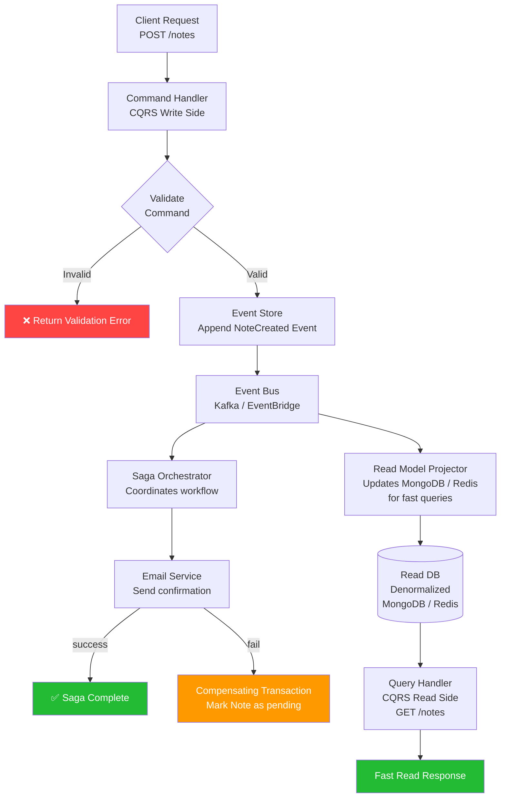

# Task: Microservices - CQRS and Event Sourcing

**Related Issue:** [#164](https://github.com/FoushWare/request-journey-client-to-server/issues/164)  
**Category:** Microservices  
**Prerequisites:** task-001 (Microservices architecture), task-002 (Database design), task-006-saga-pattern (Saga pattern), task-009-nx-monorepo (Nx monorepo)  
**Estimated Time:** 4–6 hours  
**Languages:** TypeScript/Node.js  
**Notes App Context:** Refactor the Notes service write path to use CQRS (separate command/query models) and Event Sourcing (store NoteCreated/NoteUpdated/NoteDeleted events), then show how all three patterns — Saga, CQRS, Event Sourcing — integrate in a single Notes workflow.

---

## Learning Objectives

By the end of this task, you will be able to:

- Explain CQRS and why it separates read and write concerns
- Implement a Command side (write) and a Query side (read) for the Notes service
- Explain Event Sourcing and why events are the source of truth
- Implement an append-only event store for Notes domain events
- Rebuild current state by replaying events (projections)
- Combine CQRS + Event Sourcing in one service
- Understand how Saga, CQRS, and Event Sourcing work together in a distributed system

---

## Theory Section

### 1. CQRS (Command Query Responsibility Segregation)

**Core idea**: Split one service model into two.

| Side | Responsibility | Database shape |
|------|---------------|---------------|
| **Command** (Write) | Mutate state: CreateNote, UpdateNote, DeleteNote | Normalized (RDBMS) |
| **Query** (Read) | Fetch data: GetNote, ListNotes, SearchNotes | Denormalized (NoSQL, cache) |

**Why bother?**
- Reads are 90% of most apps — optimize separately without affecting writes
- Commands can have business validation logic; queries are pure data fetches
- Each side can scale independently (more read replicas, fewer write nodes)
- Cleaner code: no overloaded `NoteService` class doing everything

**Trade-off**: Eventual consistency. After a write, the read model updates asynchronously via events — so a query right after a command may return slightly stale data.

### 2. Event Sourcing

**Core idea**: Instead of storing the current state of a record, store every change as an immutable event.

```
Traditional DB:            Event Store:
notes table                note_events table
─────────────              ─────────────────────
id | title | body          seq | aggregate_id | type          | payload
1  | Hello | World         1   | note-123     | NoteCreated   | {title: "Hello", ...}
                           2   | note-123     | NoteUpdated   | {title: "Hello World"}
                           3   | note-123     | NoteDeleted   | {}
```

**Current state = replay all events**:
```
NoteCreated → { id: "123", title: "Hello", body: "World" }
NoteUpdated → { id: "123", title: "Hello World", body: "World" }
NoteDeleted → note is marked deleted
```

**Benefits**:
- Complete audit trail — every change is recorded forever
- Time-travel debugging — replay events to reproduce any past state
- Easy CQRS integration — events drive both write and read model updates
- Event-driven architecture — other services subscribe to domain events

**Trade-offs**:
- Event schema evolution is tricky (old events must stay valid)
- Long-lived aggregates need periodic **snapshots** to avoid replaying 10,000 events
- More complex implementation than a simple CRUD service

### 3. How Saga + CQRS + Event Sourcing Work Together

```
User calls CreateNote
       ↓
Command Handler (CQRS write side)
  - validate input
  - apply business rules
       ↓
Event Sourcing: append NoteCreated to event store
       ↓
Event Bus (Kafka / EventBridge)
  ↙                    ↘
Read Model Projector    Saga Orchestrator
(updates NoSQL/cache    (triggers: SendEmailNotification
 for fast queries)       → ConfirmCreation)
```

---

## Diagram



---

## Step-by-Step Instructions

### Step 1: Define Domain Events for Notes

```typescript
// src/events/note-events.ts
export type NoteEvent =
  | { type: 'NoteCreated'; aggregateId: string; payload: { title: string; body: string; userId: string }; timestamp: Date }
  | { type: 'NoteUpdated'; aggregateId: string; payload: { title?: string; body?: string }; timestamp: Date }
  | { type: 'NoteDeleted'; aggregateId: string; payload: {}; timestamp: Date };
```

### Step 2: Implement the Event Store

```typescript
// src/event-store/event-store.ts
export class EventStore {
  async append(event: NoteEvent): Promise<void> {
    await db.query(
      'INSERT INTO note_events (aggregate_id, type, payload, timestamp) VALUES ($1, $2, $3, $4)',
      [event.aggregateId, event.type, event.payload, event.timestamp]
    );
  }

  async getEvents(aggregateId: string): Promise<NoteEvent[]> {
    const rows = await db.query(
      'SELECT * FROM note_events WHERE aggregate_id = $1 ORDER BY seq ASC',
      [aggregateId]
    );
    return rows.map(row => ({ type: row.type, aggregateId: row.aggregate_id, payload: row.payload, timestamp: row.timestamp }));
  }
}
```

### Step 3: Rebuild Current State from Events

```typescript
// src/aggregates/note-aggregate.ts
export function replayNote(events: NoteEvent[]): Note | null {
  let state: Note | null = null;
  for (const event of events) {
    if (event.type === 'NoteCreated') state = { id: event.aggregateId, ...event.payload, deleted: false };
    if (event.type === 'NoteUpdated') state = { ...state!, ...event.payload };
    if (event.type === 'NoteDeleted') state = null;
  }
  return state;
}
```

### Step 4: Implement the CQRS Command Handler

```typescript
// src/commands/create-note-command.ts
export class CreateNoteCommandHandler {
  async handle(cmd: CreateNoteCommand): Promise<void> {
    // Write side: validate, produce event
    const event: NoteEvent = {
      type: 'NoteCreated',
      aggregateId: generateId(),
      payload: { title: cmd.title, body: cmd.body, userId: cmd.userId },
      timestamp: new Date()
    };
    await eventStore.append(event);
    await eventBus.publish(event);   // notify projectors and sagas
  }
}
```

### Step 5: Implement the CQRS Query Handler

```typescript
// src/queries/get-notes-query.ts
export class GetNotesQueryHandler {
  async handle(userId: string): Promise<Note[]> {
    // Read side: hit the denormalized read model (fast)
    return readDb.find({ userId, deleted: false });
  }
}
```

### Step 6: Implement the Read Model Projector

```typescript
// src/projectors/note-projector.ts
eventBus.subscribe('NoteCreated', async (event) => {
  await readDb.insert({ id: event.aggregateId, ...event.payload, createdAt: event.timestamp });
});

eventBus.subscribe('NoteUpdated', async (event) => {
  await readDb.update({ id: event.aggregateId }, event.payload);
});

eventBus.subscribe('NoteDeleted', async (event) => {
  await readDb.delete({ id: event.aggregateId });
});
```

### Step 7: Wire Saga to Events

The Saga (task-006) subscribes to `NoteCreated` and triggers the email notification workflow. If the email fails, it emits a compensating `NoteCreationFailed` event.

---

## Verification Checklist

- [ ] POST /notes → NoteCreated event appended to event store
- [ ] Event store contains immutable event history
- [ ] Replaying events from store reconstructs correct Note state
- [ ] GET /notes → served from fast read model (not event store)
- [ ] Read model updated asynchronously after write
- [ ] Saga triggered by NoteCreated event
- [ ] Snapshot mechanism reduces replay time for old aggregates

---

## Automation Reference

> The steps above are **manual/raw** — they teach you CQRS and Event Sourcing by doing it yourself.

| What | Where | Description |
|------|-------|-------------|
| Kafka event bus | [`automation/terraform/modules/elasticache/`](../../automation/terraform/modules/elasticache/) | Managed broker for domain event pub/sub between write and read sides |
| Notes App deployment | [`automation/ansible/roles/notes-app/`](../../automation/ansible/roles/notes-app/) | Full deployment including write-side and read-side pods |
| Database for write side | [`automation/terraform/modules/rds/`](../../automation/terraform/modules/rds/) | PostgreSQL for event store (append-only note_events table) |
| Read model store | [`automation/terraform/modules/elasticache/`](../../automation/terraform/modules/elasticache/) | Redis for the denormalized query-side read model |

> 💡 The event store in RDS stores immutable domain events. Elasticache/Redis serves as the fast read projection. Kafka connects the write side to all projectors and saga orchestrators.

---

## Task Checklist

- [ ] Read and understood the theory section
- [ ] Viewed the CQRS + Event Sourcing diagram
- [ ] Completed all prerequisite tasks
- [ ] Defined domain events for Notes aggregate (NoteCreated, NoteUpdated, NoteDeleted)
- [ ] Created event store (append + replay)
- [ ] Implemented Note state reconstruction by replaying events
- [ ] Created CQRS Command Handler (CreateNote, UpdateNote, DeleteNote)
- [ ] Created CQRS Query Handler (GetNote, ListNotes)
- [ ] Implemented Read Model Projector
- [ ] Connected Saga to NoteCreated events
- [ ] Tested: write → event stored → read model updated → query returns result
- [ ] Added snapshot for long-lived aggregates
- [ ] Documented learnings

---

**Task Status:** [ ] Not Started | [ ] In Progress | [ ] Completed  
**Date Started:** ___  
**Date Completed:** ___
