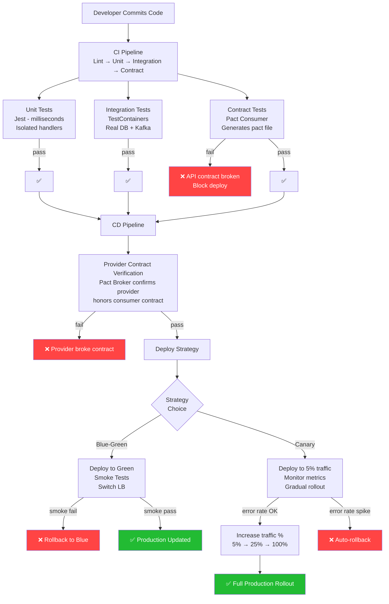

# Task: Microservices - Testing Strategy (Unit, Integration, E2E, Contract, Production)

**Related Issue:** [#165](https://github.com/FoushWare/request-journey-client-to-server/issues/165)  
**Category:** Microservices  
**Prerequisites:** task-001 (Microservices architecture), task-002 (Database design), task-009-nx-monorepo (Nx monorepo), task-014 (CI/CD pipeline gating)  
**Estimated Time:** 5–7 hours  
**Languages:** TypeScript/Node.js, YAML  
**Notes App Context:** Build a complete testing strategy for the Notes App microservices — from unit tests that run in milliseconds to contract tests that prevent API drift between services, to canary deployments that test new versions against real production traffic.

---

## Learning Objectives

By the end of this task, you will be able to:

- Write unit tests for Notes service handlers and utilities
- Write integration tests using TestContainers (real DB/broker in Docker)
- Write E2E tests that cover full request flows across all services
- Implement consumer-driven contract tests with Pact
- Configure blue-green deployment in Kubernetes
- Configure canary releases with traffic splitting
- Understand when to use each test level in the pyramid

---

## Theory Section

### The Microservices Testing Pyramid

```
         ▲
        / \
       /E2E\          ← fewest; slow, expensive, full system
      /─────\
     / Integ \        ← medium; test service + real dependencies
    /─────────\
   / Unit Tests \     ← most; fast, isolated, no I/O
  /─────────────\
```

**Rule of thumb**: Many unit tests, some integration tests, few E2E tests.

### Test Types

| Level | What it tests | Speed | Tools |
|-------|--------------|-------|-------|
| Unit | Single function/class in isolation | ~1ms | Jest, Vitest |
| Integration | Service + real DB/broker | ~1s | Jest + TestContainers |
| E2E | Full system, browser-to-DB | ~10s | Playwright, Cypress |
| Contract | API consumer/provider agreement | ~1s | Pact |
| Production (canary) | Real traffic with new version | real-time | K8s, Istio |

### Contract Testing with Pact

**Problem**: Service A (consumer) calls Service B (provider). Service B changes its API silently. Service A breaks in production.

**Solution**: 
1. Consumer writes a **contract** (Pact file): "I call `GET /notes/:id` and expect `{ id, title, body }`"
2. Contract is uploaded to a **Pact Broker**
3. Provider **verifies** it hasn't broken the contract as part of its CI pipeline
4. CD only proceeds if verification passes

```
Consumer Test          Pact Broker          Provider Test
─────────────          ───────────          ─────────────
Runs interactions →    stores Pact file →   Provider verifies
Generates Pact file                         the contract
```

### Blue-Green Deployment

```
Load Balancer
     │
     ├── Blue (v1.0) ← 100% traffic (current)
     │
     └── Green (v1.1) ← 0% traffic (new, being tested)

1. Deploy v1.1 to Green
2. Run smoke tests on Green (no real traffic)
3. Switch Load Balancer: Green = 100%, Blue = 0%
4. Keep Blue alive for instant rollback
```

### Canary Testing

```
Load Balancer
     │
     ├── Stable (v1.0) ← 95% traffic
     │
     └── Canary (v1.1) ← 5% traffic (monitored)

1. Deploy v1.1 as canary
2. Monitor: error rate, latency, user signals
3. Gradually increase canary %: 5% → 25% → 50% → 100%
4. Auto-rollback if error rate > threshold
```

---

## Diagram



---

## Step-by-Step Instructions

### Step 1: Unit Tests for Notes Service

```typescript
// src/notes/notes.service.spec.ts
import { NotesService } from './notes.service';
import { MockNotesRepository } from './__mocks__/notes.repository';

describe('NotesService', () => {
  let service: NotesService;

  beforeEach(() => {
    service = new NotesService(new MockNotesRepository());
  });

  it('should create a note and return it', async () => {
    const note = await service.createNote({ title: 'Test', body: 'Body', userId: 'u1' });
    expect(note.id).toBeDefined();
    expect(note.title).toBe('Test');
  });

  it('should throw if title is empty', async () => {
    await expect(service.createNote({ title: '', body: 'Body', userId: 'u1' }))
      .rejects.toThrow('Title is required');
  });
});
```

### Step 2: Integration Tests with TestContainers

```typescript
// src/notes/notes.integration.spec.ts
import { PostgreSqlContainer } from '@testcontainers/postgresql';

describe('Notes Integration', () => {
  let container: StartedPostgreSqlContainer;

  beforeAll(async () => {
    container = await new PostgreSqlContainer().start();
    // run migrations against the real container DB
    await runMigrations(container.getConnectionUri());
  });

  afterAll(async () => {
    await container.stop();
  });

  it('should persist and retrieve a note', async () => {
    const repo = new NotesRepository(container.getConnectionUri());
    const created = await repo.create({ title: 'Hello', body: 'World', userId: 'u1' });
    const found = await repo.findById(created.id);
    expect(found?.title).toBe('Hello');
  });
});
```

### Step 3: Consumer Contract Test with Pact

```typescript
// src/notes/notes-consumer.pact.spec.ts
import { PactV3, MatchersV3 } from '@pact-foundation/pact';

const provider = new PactV3({ consumer: 'Frontend', provider: 'NotesAPI' });

describe('Notes API Contract', () => {
  it('should return a note by ID', async () => {
    await provider
      .given('note with id note-123 exists')
      .uponReceiving('a GET request for note-123')
      .withRequest({ method: 'GET', path: '/notes/note-123' })
      .willRespondWith({
        status: 200,
        body: {
          id: MatchersV3.string('note-123'),
          title: MatchersV3.string('Test Note'),
          body: MatchersV3.string('Some content'),
        },
      })
      .executeTest(async (mockServer) => {
        const result = await fetch(`${mockServer.url}/notes/note-123`).then(r => r.json());
        expect(result.id).toBe('note-123');
      });
  });
});
```

### Step 4: E2E Test

```typescript
// e2e/notes.e2e.spec.ts  (Playwright)
test('user can create and view a note', async ({ page }) => {
  await page.goto('http://localhost:3000');
  await page.fill('[data-testid="note-title"]', 'My E2E Note');
  await page.fill('[data-testid="note-body"]', 'Created by Playwright');
  await page.click('[data-testid="save-note"]');
  await expect(page.locator('[data-testid="note-list"]')).toContainText('My E2E Note');
});
```

### Step 5: Blue-Green Deployment in Kubernetes

```yaml
# k8s/notes-api-blue.yaml
apiVersion: apps/v1
kind: Deployment
metadata:
  name: notes-api-blue
spec:
  replicas: 3
  selector:
    matchLabels: { app: notes-api, slot: blue }
  template:
    metadata:
      labels: { app: notes-api, slot: blue }
    spec:
      containers:
        - name: notes-api
          image: notes-api:v1.0
---
# Switch traffic to green after smoke tests pass:
# kubectl patch service notes-api -p '{"spec":{"selector":{"slot":"green"}}}'
```

### Step 6: Canary Release with Istio VirtualService

```yaml
# k8s/notes-api-canary.yaml
apiVersion: networking.istio.io/v1alpha3
kind: VirtualService
metadata:
  name: notes-api
spec:
  hosts: [notes-api]
  http:
    - route:
        - destination: { host: notes-api, subset: stable }
          weight: 95
        - destination: { host: notes-api, subset: canary }
          weight: 5    # 5% to canary
```

---

## Verification Checklist

- [ ] Unit tests pass in < 5 seconds
- [ ] Integration tests pass with TestContainers (real PostgreSQL)
- [ ] Pact consumer contract file generated
- [ ] Provider verifies consumer contract without failure
- [ ] E2E test creates and retrieves a note end-to-end
- [ ] Blue-green: traffic switched to green, blue remains on standby
- [ ] Canary: 5% traffic routed to new version, error rate monitored
- [ ] Failed unit test blocks CI (from task-014 gating)

---

## Automation Reference

> The steps above are **manual/raw** — they teach microservices testing by doing it yourself.

| What | Where | Description |
|------|-------|-------------|
| Kubernetes deployment | [`automation/ansible/roles/kubernetes/`](../../automation/ansible/roles/kubernetes/) | Ansible role for deploying blue-green slots and canary VirtualServices |
| Notes App deployment | [`automation/ansible/roles/notes-app/`](../../automation/ansible/roles/notes-app/) | Full notes-app with blue/green/canary environment configurations |
| Container registry | [`automation/terraform/modules/ecr/`](../../automation/terraform/modules/ecr/) | ECR module for tagging and storing blue, green, and canary image versions |
| Service mesh | Istio (task-012 sidecar, future service-mesh tasks) | VirtualService and DestinationRule for traffic splitting |

> 💡 ECR stores tagged images for each deployment slot. Ansible deploys blue/green Kubernetes Deployments. Istio VirtualService splits traffic by weight for canary releases.

---

## Task Checklist

- [ ] Read and understood the theory section
- [ ] Viewed the testing pipeline diagram
- [ ] Completed all prerequisite tasks
- [ ] Unit tests written for Notes service (at least 5 test cases)
- [ ] Mock repository implemented for unit test isolation
- [ ] Integration tests using TestContainers with real PostgreSQL
- [ ] Pact consumer contract test written and pact file generated
- [ ] Pact provider verification test written
- [ ] E2E test with Playwright covers create + view note
- [ ] Blue-green Kubernetes manifests created
- [ ] Canary Istio VirtualService created
- [ ] Canary error rate monitoring configured
- [ ] Documented learnings

---

**Task Status:** [ ] Not Started | [ ] In Progress | [ ] Completed  
**Date Started:** ___  
**Date Completed:** ___
