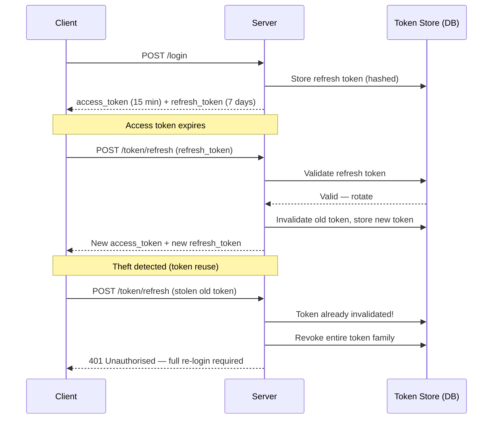

# Task: JWT Refresh Tokens Deep Dive

**Related Issue:** #155  
**Category:** Security  
**Prerequisites:** task-011-sessions-vs-jwt  
**Estimated Time:** 2–3 hours  
**Notes App Context:** Implement production-grade JWT with refresh token rotation

---

## Learning Objectives

- Understand refresh token rotation
- Implement token families to detect theft
- Handle concurrent refresh requests
- Implement token revocation at scale

---

## Refresh Token Rotation

Every time a refresh token is used, it's replaced with a new one (rotation):

```
1. Login → access_token (15m) + refresh_token_A (7d)
2. Access token expires → Use refresh_token_A → get access_token_new + refresh_token_B
3. refresh_token_A is now INVALID
4. Next refresh must use refresh_token_B
```

### Detecting Token Theft

If an attacker steals refresh_token_A and uses it AFTER the legitimate user already exchanged it:
- Server sees refresh_token_A being used, but it was already rotated to refresh_token_B
- This indicates theft → **revoke the entire token family**
- All sessions for this user are terminated

---

## Implementation

### Token Family Concept

Group tokens by family ID:

```typescript
interface RefreshToken {
  tokenId: string;      // unique per token
  familyId: string;     // shared across all rotations
  userId: string;
  rotatedFrom: string | null;  // previous token ID
}
```

When a token is used:
1. Check it exists in the DB
2. If it doesn't exist → theft detected → revoke entire family
3. If it exists → rotate (delete old, create new)

---

## Task Checklist

- [ ] Refresh token rotation implemented
- [ ] Token families tracked for theft detection
- [ ] Theft detection revokes entire family
- [ ] Concurrent refresh requests handled safely
- [ ] Tested: stolen refresh token triggers full revocation

---

**Task Status:** [ ] Not Started | [ ] In Progress | [ ] Completed

---

## Diagram



---

## Automation Reference

> The steps above are **manual/raw** — they teach you the concept by doing it yourself.  
> The `automation/` directory contains the production-grade IaC equivalent:

| What | Where | Description |
|------|-------|-------------|
| Security Role | [`automation/ansible/roles/security/`](../../automation/ansible/roles/security/) | Configures secure token handling, HTTPS enforcement, and security headers |
| RDS Module | [`automation/terraform/modules/rds/`](../../automation/terraform/modules/rds/) | PostgreSQL used to persist refresh token records and token family state |
| KMS Module | [`automation/terraform/modules/kms/`](../../automation/terraform/modules/kms/) | KMS customer-managed key for signing JWT tokens in production |
