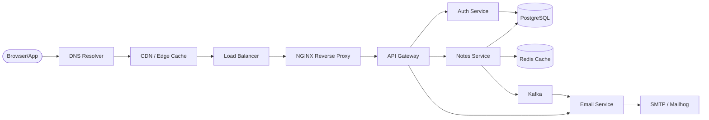

# Task: Architecture Diagrams for the Notes App System

**Related Issue:** #153  
**Category:** System Design  
**Prerequisites:** Understanding of the Notes App's components  
**Estimated Time:** 3–4 hours  
**Notes App Context:** Create comprehensive visual documentation of the entire system

---

## Learning Objectives

- Design a full-system architecture diagram
- Use Mermaid for code-based diagrams in markdown
- Use draw.io for rich visual diagrams
- Follow the C4 Model for architecture documentation

---

## Diagrams to Create

### 1. Full Request Journey Diagram (Mermaid)



### 2. Microservices Communication Diagram

Shows how services communicate:
- REST (synchronous)
- gRPC (synchronous, high-performance)
- Kafka (asynchronous, event-driven)

### 3. CI/CD Pipeline Diagram

```
Code Push → GitHub → GitHub Actions → Docker Build 
→ Push to Registry → Kubectl Apply → Kubernetes Cluster
```

### 4. Observability Stack Diagram

```
Services → Prometheus (scrape) → Grafana (visualize)
Services → Filebeat → Logstash → Elasticsearch → Kibana
Services → Jaeger (traces)
```

### 5. Database Topology Diagram

Shows which service owns which database:
- Auth Service → PostgreSQL (users table)
- Notes Service → MongoDB (notes) + Redis (cache)
- Search Service → Elasticsearch
- Graph features → Neo4j

---

## Step-by-Step Instructions

### Step 1: Create Mermaid Diagrams

1. Create `docs/diagrams/` directory
2. Create `docs/diagrams/01-system-overview.md` with Mermaid flowchart
3. Create `docs/diagrams/02-microservices.md` with service communication
4. Create `docs/diagrams/03-cicd-pipeline.md` with CI/CD flow
5. Create `docs/diagrams/04-observability.md` with monitoring stack
6. Create `docs/diagrams/05-database-topology.md` with data ownership

### Step 2: Create Visual Diagrams with draw.io

1. Install draw.io desktop app or use https://app.diagrams.net
2. Create the full system diagram visually
3. Export as PNG and SVG to `docs/diagrams/assets/`

### Step 3: C4 Model Diagrams

The C4 Model has 4 levels of abstraction:
- **Level 1: System Context** — What external systems does the Notes App interact with?
- **Level 2: Container** — What deployable units make up the Notes App?
- **Level 3: Component** — What components are inside each container?
- **Level 4: Code** — Class/function level (optional)

Create Level 1 and Level 2 diagrams using Mermaid.

---

## Verification

1. All 5 diagram types created
2. Mermaid diagrams render correctly in GitHub
3. draw.io diagram exported as PNG
4. C4 Level 1 and Level 2 diagrams created

---

## Task Checklist

- [ ] System overview diagram created (Mermaid)
- [ ] Microservices communication diagram created
- [ ] CI/CD pipeline diagram created
- [ ] Observability stack diagram created
- [ ] Database topology diagram created
- [ ] draw.io visual diagram created
- [ ] C4 Level 1 and 2 diagrams created
- [ ] All diagrams linked from README.md

---

**Task Status:** [ ] Not Started | [ ] In Progress | [ ] Completed
