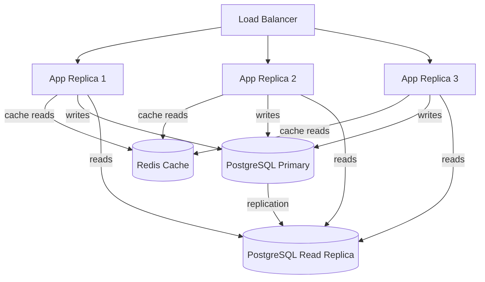

# Task: Scaling Solutions for the Notes App

**Related Issue:** #154  
**Category:** System Design  
**Prerequisites:** task-002-load-testing-k6  
**Estimated Time:** 5–6 hours  
**Notes App Context:** Apply scaling solutions to handle 10K → 100K → 1M users

---

## Learning Objectives

- Apply horizontal scaling with Kubernetes HPA
- Add Redis caching to reduce database load
- Set up PostgreSQL read replicas
- Add a CDN for static assets
- Understand CQRS (Command Query Responsibility Segregation) conceptually

---

## Scaling Ladder

### Level 1: Single Server (< 1K users)
✅ Already done — Notes App runs as a single Docker container

### Level 2: Add Caching (1K–10K users)

Problem: Repeated database reads for the same data
Solution: Redis cache

```
Request → Notes API → Redis Cache → (miss) → PostgreSQL
                   ↗ (hit: return cached data)
```

**Tasks:**
1. Add Redis to docker-compose.yml
2. Cache `GET /api/notes` responses with 60s TTL
3. Invalidate cache on note create/update/delete
4. Re-run k6 test and compare results

### Level 3: Horizontal Scaling (10K–100K users)

Problem: Single API instance is the bottleneck
Solution: Multiple API instances behind a load balancer

```
NGINX Load Balancer
  ├── Notes API (instance 1)
  ├── Notes API (instance 2)
  └── Notes API (instance 3)
```

**Tasks:**
1. Scale Notes API to 3 replicas in Kubernetes
2. Configure NGINX round-robin load balancing
3. Ensure session handling is stateless (JWT, not server sessions)
4. Re-run k6 test and compare results

### Level 4: Read Replicas (100K+ users)

Problem: Write-heavy database is the bottleneck
Solution: PostgreSQL primary + read replicas

```
Write requests → PostgreSQL Primary
Read requests  → PostgreSQL Replica 1
               → PostgreSQL Replica 2
```

**Tasks:**
1. Set up PostgreSQL streaming replication with Docker
2. Route read queries to replicas
3. Route write queries to primary
4. Monitor replication lag

### Level 5: Database Sharding (conceptual, 1M+ users)

Problem: Even replicas can't handle all read traffic
Solution: Horizontal database sharding by user_id

- Users 0–999K → Shard A
- Users 1M–2M → Shard B

This is complex and requires application-level changes. Cover conceptually.

---

## Step-by-Step Instructions

### Step 1: Implement Redis Caching

See `implementation/system-design/task-003-scaling-solutions/starter/` for scaffolding.

### Step 2: Horizontal Scaling in Kubernetes

```yaml
apiVersion: apps/v1
kind: Deployment
metadata:
  name: notes-api
spec:
  replicas: 3  # Scale to 3
```

Add HPA to auto-scale based on CPU:
```yaml
apiVersion: autoscaling/v2
kind: HorizontalPodAutoscaler
metadata:
  name: notes-api-hpa
spec:
  scaleTargetRef:
    name: notes-api
  minReplicas: 2
  maxReplicas: 10
  metrics:
  - type: Resource
    resource:
      name: cpu
      target:
        averageUtilization: 70
```

### Step 3: Measure Each Level

After each scaling solution, run k6 and record:

| Level | Max RPS | P95 Latency | Error Rate @ 1000 users |
|-------|---------|-------------|------------------------|
| Single instance | ? | ? | ? |
| + Redis cache | ? | ? | ? |
| + 3 replicas | ? | ? | ? |
| + Read replicas | ? | ? | ? |

---

## Task Checklist

- [ ] Redis caching implemented and tested
- [ ] Horizontal scaling with 3 replicas tested
- [ ] HPA configured for auto-scaling
- [ ] PostgreSQL read replica set up
- [ ] Results measured and compared at each level
- [ ] Scaling report documented

---

**Task Status:** [ ] Not Started | [ ] In Progress | [ ] Completed

---

## Diagram



---

## Automation Reference

> The steps above are **manual/raw** — they teach you the concept by doing it yourself.  
> The `automation/` directory contains the production-grade IaC equivalent:

| What | Where | Description |
|------|-------|-------------|
| ElastiCache (Redis) | [`automation/terraform/modules/elasticache/`](../../automation/terraform/modules/elasticache/) | Provisions the Redis cache cluster used to reduce database load |
| RDS with Read Replica | [`automation/terraform/modules/rds/`](../../automation/terraform/modules/rds/) | PostgreSQL primary + read replica for horizontal read scaling |
| EKS with HPA | [`automation/terraform/modules/eks/`](../../automation/terraform/modules/eks/) | Kubernetes cluster with Horizontal Pod Autoscaler for app replicas |
