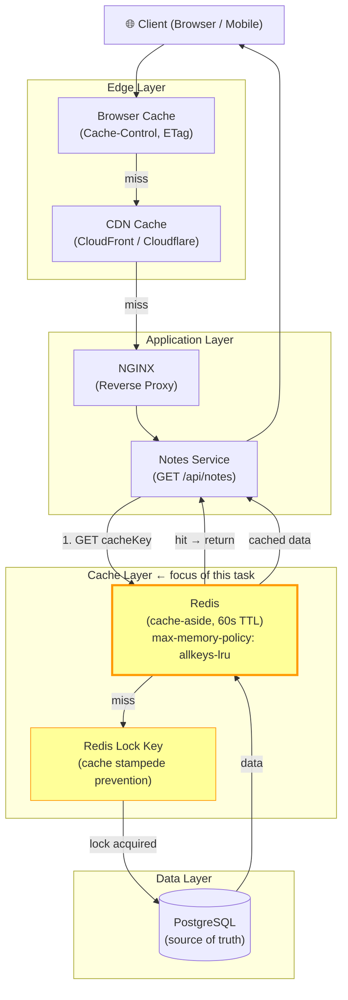

# Task: Caching Strategy for the Notes App

**Related Issue:** #154  
**Category:** System Design  
**Prerequisites:** task-003-scaling-solutions  
**Estimated Time:** 3 hours  
**Language:** Go, Python, or TypeScript  
**Notes App Context:** Implement multi-layer caching for the Notes App  
**Automation Reference:** [`automation/terraform/modules/elasticache/`](../../automation/terraform/modules/elasticache/) · [`automation/ansible/roles/notes-app/`](../../automation/ansible/roles/notes-app/)

> 💡 **Manual vs Automated**: This task teaches caching step-by-step manually.  
> `automation/terraform/modules/elasticache/` provisions the production Redis cluster automatically.

---

## Learning Objectives

- Understand different caching layers (browser, CDN, server, database)
- Implement Redis cache-aside pattern
- Understand cache eviction policies
- Handle cache invalidation correctly
- Understand cache stampede problem and how to prevent it

---

## Architecture Diagram

> Where caching sits in the Notes App request journey:



**Full project diagram:** [docs/diagrams/00-big-picture.md](../docs/diagrams/00-big-picture.md)  
**Related diagram:** [docs/diagrams/05-database-topology.md](../docs/diagrams/05-database-topology.md)

---

## Caching Layers

```
Browser Cache (HTTP headers: Cache-Control, ETag)
    ↓ miss
CDN Cache (CloudFront / Cloudflare)
    ↓ miss
Application Cache (Redis / Memcached)
    ↓ miss
Database Query Cache
    ↓ miss
Database Disk
```

Each layer reduces load on the layers below.

---

## Caching Patterns

### Cache-Aside (Lazy Loading)
1. Check cache
2. If miss: fetch from DB, store in cache, return
3. If hit: return from cache

✅ Most common pattern  
✅ Cache only has data that's actually needed  
⚠️ First request is always a miss

### Write-Through
1. Write to cache AND database simultaneously

✅ Cache is always up to date  
⚠️ Writes are slower  
⚠️ Lots of cached data that may never be read

### Write-Behind (Write-Back)
1. Write to cache only
2. Cache asynchronously writes to database

✅ Very fast writes  
⚠️ Data loss risk if cache crashes before write

---

## Step-by-Step Instructions

### Step 1: Add Redis to Docker Compose

```yaml
redis:
  image: redis:7-alpine
  ports:
    - "6379:6379"
  command: redis-server --maxmemory 256mb --maxmemory-policy allkeys-lru
```

### Step 2: Implement Cache-Aside for GET /api/notes

```typescript
async function getNotes(userId: string) {
  const cacheKey = `notes:user:${userId}`;
  
  // Check cache
  const cached = await redis.get(cacheKey);
  if (cached) {
    return JSON.parse(cached);
  }
  
  // Cache miss: fetch from DB
  const notes = await db.query('SELECT * FROM notes WHERE user_id = $1', [userId]);
  
  // Store in cache (60 seconds TTL)
  await redis.setex(cacheKey, 60, JSON.stringify(notes));
  
  return notes;
}
```

### Step 3: Implement Cache Invalidation

```typescript
async function createNote(userId: string, content: string) {
  // Write to database
  const note = await db.query('INSERT INTO notes ...', [userId, content]);
  
  // Invalidate user's notes cache
  await redis.del(`notes:user:${userId}`);
  
  return note;
}
```

### Step 4: Handle Cache Stampede

Problem: When the cache expires, 1000 concurrent requests all miss and hit the DB simultaneously.

Solution: **Probabilistic Early Expiration** or **Mutex Lock**

```typescript
const MAX_LOCK_RETRIES = 10;
const LOCK_RETRY_DELAY_MS = 100;

async function getNotesWithLock(userId: string): Promise<Note[]> {
  const cacheKey = `notes:user:${userId}`;
  const lockKey = `lock:${cacheKey}`;

  for (let attempt = 0; attempt < MAX_LOCK_RETRIES; attempt++) {
    const cached = await redis.get(cacheKey);
    if (cached) return JSON.parse(cached);

    // Try to acquire lock (SET NX = set if not exists, EX = expire in 5s)
    const lockAcquired = await redis.set(lockKey, '1', 'NX', 'EX', 5);
    if (lockAcquired) {
      try {
        // Fetch from DB and populate cache
        const notes = await db.query('SELECT * FROM notes WHERE user_id = $1', [userId]);
        await redis.setex(cacheKey, 60, JSON.stringify(notes));
        return notes;
      } finally {
        await redis.del(lockKey);
      }
    }

    // Another process holds the lock — wait before retrying
    await sleep(LOCK_RETRY_DELAY_MS);
  }

  // Exceeded retries: fall through to DB to avoid complete failure
  const notes = await db.query('SELECT * FROM notes WHERE user_id = $1', [userId]);
  return notes;
}
```

### Step 5: Monitor Cache Hit Rate

Add a Grafana panel showing:
- Cache hit rate (%)
- Cache miss rate (%)
- Redis memory usage
- Eviction count

---

## Task Checklist

- [ ] Redis added to Docker Compose
- [ ] Cache-aside pattern implemented for GET notes
- [ ] Cache invalidation on write (create/update/delete)
- [ ] Cache stampede prevention implemented
- [ ] Cache hit rate monitored in Grafana
- [ ] Eviction policy set (LRU)

---

## Automation Reference

> The steps above are **manual/raw** — they teach you caching by doing it yourself.  
> The `automation/` directory contains the production-grade IaC equivalent:

| What | Where | Description |
|------|-------|-------------|
| Redis / ElastiCache cluster | [`automation/terraform/modules/elasticache/`](../../automation/terraform/modules/elasticache/) | Provisions AWS ElastiCache (Redis) with replication, encryption, and parameter groups |
| App deployment with Redis env vars | [`automation/ansible/roles/notes-app/`](../../automation/ansible/roles/notes-app/) | Injects `REDIS_URL` into the Notes App deployment |
| Monitoring (cache hit rate) | [`automation/ansible/roles/monitoring/`](../../automation/ansible/roles/monitoring/) | Deploys kube-prometheus-stack; add a Redis exporter to expose cache metrics |

> 💡 Complete this task manually first. Then read the automation code to see how ElastiCache is configured in production (multi-AZ, auth tokens, encryption at rest).

---

**Task Status:** [ ] Not Started | [ ] In Progress | [ ] Completed
